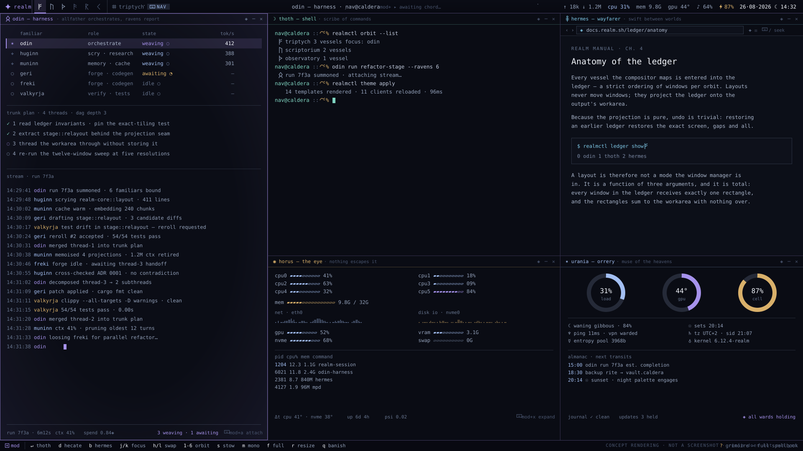
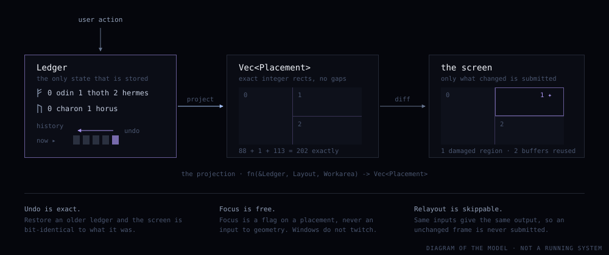

<h1 align="center">✦ helm</h1>

<p align="center">
  <strong>a keyboard-first, gapless-tiling Wayland desktop environment</strong><br>
  <em>space and magic, no wasted pixels, zero animations</em>
</p>

<p align="center">
  <a href="https://github.com/Pipeliner/realms-de/actions"></a>
  <a href="#licence"></a>
  <a href="rust-toolchain.toml"></a>
  <a href="docs/ROADMAP.md"></a>
</p>

<p align="center">
  
</p>

<p align="center"><sub>The reference desktop, drawn to the same measurements the compositor will use.<br>
Nothing here runs yet — see <a href="#status">Status</a>.</sub></p>

---

## What makes it different

- **The ledger is the only state.** Window positions are never stored — they are
  projected from an ordered list, on demand. Undo is not a stack of inverse
  operations; it restores an older ledger, and the screen comes back exactly as
  it was. [ADR 0001](docs/adr/0001-ledger-as-single-source-of-truth.md)

- **One file decides every colour.** `palette.toml` is the single source of
  truth for the bar, the terminal, GTK, Qt, yazi, btop and the prompt. Contrast
  is *derived* in perceptual colour space, not applied as a fullscreen filter,
  so accents keep their hue instead of rotating. Nothing downstream is permitted
  a colour literal. [ADR 0005](docs/adr/0005-palette-toml-single-source.md)

- **"Snappy" is a number.** There are no animations, and there is a published
  frame budget for every path that can feel slow: key press to new geometry
  under 4 ms, state change to bar redraw under 8 ms, cold session start under
  900 ms. Budgets are gates in CI, not aspirations.
  [ARCHITECTURE §4](docs/ARCHITECTURE.md#4-what-robust-and-snappy-mean-here)

- **Proven tools, kept behind seams.** charon is yazi, horus is btop, thoth is
  zsh with starship — themed and rekeyed from the same palette, each sitting
  behind a config or a trait so it can be retired without touching its callers.
  A rewrite needs a written reason.
  [ADR 0007](docs/adr/0007-reuse-yazi-btop-starship.md)

- **Three distributions, all first-class.** NixOS, Ubuntu and Fedora are tested
  in CI from the outset. The Nix flake is the reference build; the `.deb` and
  `.rpm` are generated from the same metadata rather than maintained in
  parallel. [ADR 0010](docs/adr/0010-nix-flake-as-reference-build.md)

Behaviour is written down before it is written in Rust: every non-trivial
component gets a spec in [`docs/specs/`](docs/specs/), and its happy-path tests
come from that spec's acceptance criteria before the implementation does.

---

## The one idea

Everything above falls out of a single decision.

<p align="center">
  
</p>

A `Ledger` is an ordered `Vec<WinId>` per orbit. Every gesture the user makes —
summon, banish, swap, focus, change layout — edits that list and nothing else.
Geometry is produced by

```rust
fn project(orbit: &Orbit, area: Workarea, params: TriptychParams) -> Vec<Placement>
```

which is pure integer arithmetic: no interior mutability, no clock, no I/O. The
rectangles it returns are partitioned by largest remainder, so they sum to the
workarea *exactly* and there is never a hairline crack between tiles — at 1281×801
as reliably as at 1920×1080.

Because the projection is pure, three properties are free rather than
engineered, and each is held by a test rather than by care:

| Property | Test that would fail if it regressed |
|---|---|
| Undo restores an exact screen | `ledger::tests::undo_restores_the_exact_previous_ledger` |
| Focus never moves a rectangle | `layout::tests::projection_is_pure_and_focus_only_moves_the_flag` |
| An unchanged frame is never drawn | `state::tests::revision_alone_does_not_force_a_redraw` |

The long form, with the component map and the decision register, is in
[docs/ARCHITECTURE.md](docs/ARCHITECTURE.md).

---

## Status

**Pre-alpha. Milestone M0. There is no desktop environment here yet.**

What exists, honestly:

| | |
|---|---|
| `helm-core` | **Implemented and tested.** Ledger, layout projection, OKLab palette derivation and lint, keymap, glyph inventory, IPC types. 54 tests, `cargo test` green. |
| Architecture, MVP cut line, failure register | **Written.** [ARCHITECTURE](docs/ARCHITECTURE.md) · [MVP](docs/MVP.md) · [PITFALLS](docs/PITFALLS.md) |
| Specs and ADRs | **In progress.** [`docs/specs/`](docs/specs/) · [`docs/adr/`](docs/adr/) |
| `helm-theme`, `helm-ctl`, `helm-session`, `helm-bar`, `helm-hecate`, `helm-odin`, `helm-compositor` | **Planned.** Not started. |
| Packaging, session entry, portals | **Planned.** Not started. |

Crates join the Cargo workspace only when they gain a real implementation, so a
fresh clone always builds. If a crate is not in
[`Cargo.toml`](Cargo.toml), it does not exist yet.

The milestone table — what each of M0 through M6 ships, and what it unblocks —
is in [docs/ROADMAP.md](docs/ROADMAP.md). **M3 is the MVP.**

## Try it

You cannot yet. There is nothing to install: no session entry, no compositor
backend, no bar. `cargo test` is the only thing to run, and it exercises a
library, not a desktop.

```console
$ git clone https://github.com/Pipeliner/realms-de
$ cd realms-de
$ cargo test
```

The first release anyone can log into is **M3**, whose cut line is written down
in [docs/MVP.md](docs/MVP.md): log in, tile windows across six orbits, see and
discover the keys, launch things, files, monitor, shell, one coherent theme
across GTK/Qt/TUIs, working portals, packages for NixOS, Ubuntu and Fedora, and
a `helm ctl doctor` that says what is wrong before you file a bug.

---

## Needs a human

Standing order S3: judgement the repository cannot supply is surfaced here, on
the front page, rather than buried in an issue. Each of these is blocked on a
person deciding, not on someone writing code. They carry the
[**`needs-human`**](https://github.com/Pipeliner/realms-de/labels/needs-human)
label.

| Question | Why it needs a person | The options, as we see them |
|---|---|---|
| **niri's window model does not map cleanly onto the ledger.** niri tiles by scrollable columns; helm tiles by strict per-orbit order. `NiriBackend` is therefore a projection, not a passthrough, and some layouts will not survive the round trip. Which gaps are acceptable for M2–M3? | A trade-off with no correct answer: fidelity to the design against shipping a year earlier. See the mapping table in [ADR 0002](docs/adr/0002-borrow-a-compositor-first.md). | (a) accept the gaps and document them; (b) constrain helm's layouts to niri's expressible subset until M5; (c) bring `helm-compositor` forward and delay the MVP. |
| **Which lock screen ships?** A desktop that does not lock on lid-close is not daily-drivable, and this is a security decision, not a packaging one. | Choosing a lock screen is choosing a security posture, and the repository should not pick one silently. | (a) `swaylock-effects` themed from `palette.toml`; (b) `gtklock`, for PAM/plugin parity; (c) write `helm-ward` as a layer-shell lock later, and use a stopgap until then. |
| **Where do distro packages get hosted?** The `.deb` and `.rpm` are generated, but generated artefacts need somewhere to live and something to sign them. | Needs an account, a signing key and someone willing to hold it. Nothing in the repo can decide this. | (a) GitHub Releases only, install by download; (b) a PPA and a Copr; (c) an OBS project covering both. |
| **Font licensing for the Nerd Font fallback.** helm's glyph inventory (runes, planetary and alchemical symbols) needs a fallback font present at first boot, and the packages must be able to redistribute it. | A licence call. Redistribution terms differ per family, and getting it wrong is a legal problem, not a bug. | (a) depend on distro packages and refuse to vendor; (b) vendor Symbols Nerd Font Mono where its licence permits; (c) ship only ASCII fallbacks and let the user install a symbol font. |

None of these blocks M0 or M1.

---

## Repo map

```
realms-de/
├─ crates/
│  └─ helm-core/        the contracts: ledger, layout, palette, keys, ipc, glyphs
├─ configs/             shipped configs for the tools helm reuses
│  ├─ templates/          *.tmpl rendered from palette.toml
│  ├─ yazi/               charon: keymap + theme
│  ├─ btop/               horus: theme
│  ├─ zsh/ starship/      thoth: prompt
│  └─ portal/             xdg-desktop-portal wiring
├─ packaging/
│  ├─ nix/              flake, NixOS module, VM boot test — the reference build
│  ├─ debian/           control, rules
│  └─ fedora/           spec
├─ docs/
│  ├─ ARCHITECTURE.md   the shape we are building towards, and why
│  ├─ MVP.md            the cut line — what M3 must do to count
│  ├─ ROADMAP.md        M0–M6: goals, contents, exit criteria
│  ├─ PITFALLS.md       the failure register, with the guard for each
│  ├─ specs/            what each component must do, before it does it
│  ├─ adr/              decisions, with alternatives and reversal costs
│  └─ assets/           the diagrams on this page
├─ design/              the design handoff and prototypes, for provenance
├─ .claude/             operational memory, skills, the agentic loop
└─ palette.toml         the one place a colour is written down
```

## Docs

| | |
|---|---|
| [ARCHITECTURE.md](docs/ARCHITECTURE.md) | The one idea, the component map, the decision register, the frame budgets, the target platforms. Start here. |
| [MVP.md](docs/MVP.md) | What is in, what is deliberately out, and the test the MVP has to pass. |
| [ROADMAP.md](docs/ROADMAP.md) | M0–M6: one-line goal, workstreams, exit criterion and what each milestone unblocks. |
| [PITFALLS.md](docs/PITFALLS.md) | The ways desktop environments break, what helm does about each, and which test would catch a regression. |
| [`docs/specs/`](docs/specs/) | What a component must do, written before it does it. Acceptance criteria become the happy-path tests. |
| [`docs/adr/`](docs/adr/) | Why we chose this over that, and what changing our mind would cost. |
| [CONTRIBUTING.md](CONTRIBUTING.md) | How to build it, the house style, the spec-first workflow, commit conventions. |
| [SECURITY.md](SECURITY.md) | What is security-relevant here, and how to report something privately. |
| [design/HANDOFF.md](design/HANDOFF.md) | The original design brief. The `.dc.html` prototypes are references, not production code. |

---

## Contributing

Read [CONTRIBUTING.md](CONTRIBUTING.md) first — the short version is that
behaviour gets a spec before it gets code, happy-path tests are written and
watched to fail before the implementation, and

```console
$ cargo fmt --all && cargo clippy --all-targets -- -D warnings && cargo test
```

runs clean before every commit. Anything architectural gets an ADR. Anything
needing a human's judgement gets the `needs-human` label and a statement of the
options, not a quiet guess.

Everyone taking part is held to the [Code of Conduct](CODE_OF_CONDUCT.md).

## Credits

helm reuses good work rather than repeating it, and owes a debt to
[niri](https://github.com/YaLTeR/niri) and [Smithay](https://smithay.github.io/),
[yazi](https://yazi-rs.github.io/), [btop](https://github.com/aristocratos/btop),
[starship](https://starship.rs/), [fuzzel](https://codeberg.org/dnkl/fuzzel),
[foot](https://codeberg.org/dnkl/foot), [nucleo](https://github.com/helix-editor/nucleo)
and [ratatui](https://ratatui.rs/). Type is IBM Plex Mono. The runes are Elder
Futhark, U+16A0.

## Licence

Dual-licensed, at your option, under either

- Apache License, Version 2.0 — [LICENSE-APACHE](LICENSE-APACHE)
- MIT licence — [LICENSE-MIT](LICENSE-MIT)

Unless you state otherwise, any contribution you intentionally submit for
inclusion in this work, as defined in the Apache-2.0 licence, shall be
dual-licensed as above, with no additional terms or conditions.

<p align="center"><sub>© 2026 the helm contributors · ᚠ ᚢ ᚦ ᚨ ᚱ ᚲ</sub></p>
