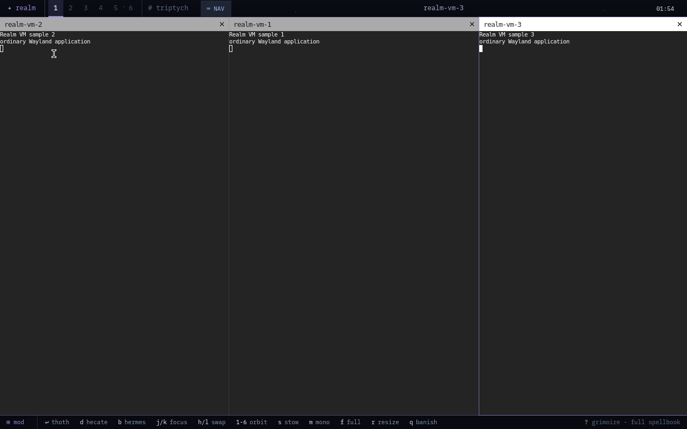
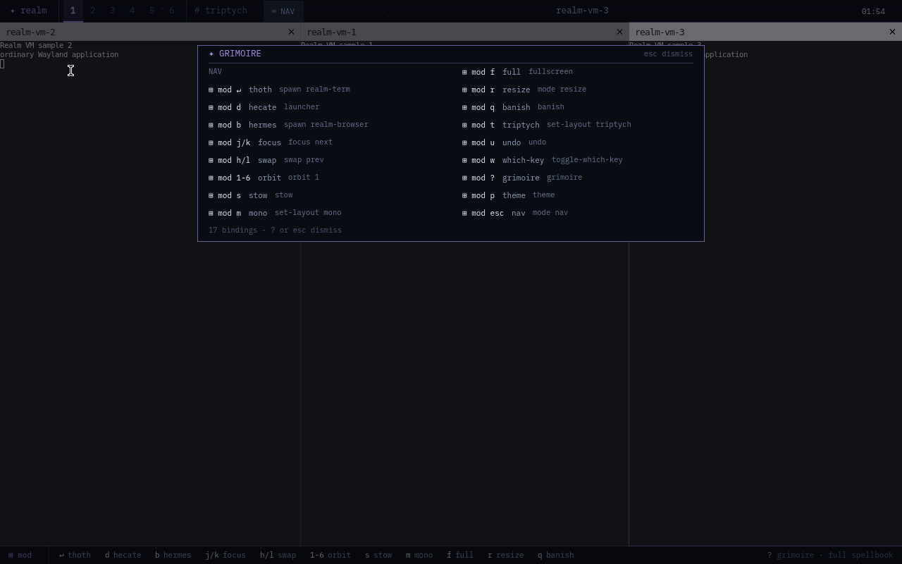
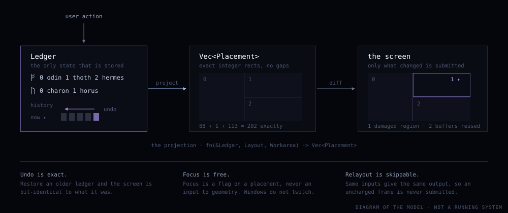

# Realm: first functional prototype

The active prototype is a small configuration for **packaged Sway**, using
Foot, Fuzzel, Thunar, swaybar/i3status, swayidle and swaylock. No Realm binary,
palette generator, private compositor or custom bar is required.

The previous Rust/River implementation is preserved below as a historical
experiment. Its palette, ledger, custom WM/bar and private-tool packaging are
shelved from the first-prototype path. [SPEC 0033](docs/specs/0033-sway-functional-prototype.md)
defines the current scope.

## Run the prototype

Use a Linux machine with the upstream programs already installed. Package
installation and bundle creation in this project are performed in CI. To
provision your own Ubuntu or Fedora machine, the upstream packages are:

```sh
# Ubuntu 24.04
sudo apt install sway foot fuzzel thunar i3status swayidle swaylock brightnessctl xdg-utils xwayland xdg-desktop-portal-wlr xdg-desktop-portal-gtk
# Fedora: use dnf install with the same package names.
```

Keep your current desktop installed. From a checkout, log out to a text console,
log in as your ordinary user, then run:

```sh
./prototype/realm-prototype
```

It uses the adjacent config without overwriting your existing application or
Sway settings. Launch from a text console; launching inside an existing desktop
is rejected to preserve that desktop's D-Bus activation environment.
A browser must already be configured
as the default handler for HTTP URLs. Portals require the distribution's Sway
integration, wlr backend and GTK fallback; their functionality is unverified.

The keys use Super: Return opens a terminal; D opens the launcher; E opens files;
B opens the browser; Shift+Q closes a window; H/J/K/L focus; Shift+H/J/K/L move;
1–6 select workspaces; Shift+1–6 move a window; F toggles fullscreen;
Shift+Space toggles floating; Shift+C reloads; Ctrl+L locks; Shift+E exits.

CI validates the config and runs a real headless graphical session with window,
workspace and screenshot evidence. **Runtime verification is pending for this
new prototype.** Headless proof does not verify physical hardware, PAM unlock,
screen sharing or suspend/resume. Suspend remains post-MVP. Idle dim at five
minutes and lock/blank at ten are configured; brightness needs an accessible
backlight and packaged brightnessctl.

[Prototype CI](https://github.com/Pipeliner/realms-de/actions/workflows/prototype.yml)
retains the runnable configuration bundle and graphical evidence. Check its
exact revision and result before downloading; a bundle is not a release.

## Historical Rust/River experiment

The remainder records the earlier design and its evidence, not the current
prototype's requirements or verified behavior.

<h1 align="center">✦ realm — historical design</h1>

<p align="center">
  <strong>a keyboard-first, gapless-tiling, Rust-first Wayland desktop environment</strong><br>
  <em>zero animations, one palette file · space and magic, no wasted pixels</em>
</p>

<p align="center">
  <a href="https://github.com/Pipeliner/realms-de/actions"></a>
  <a href="#licence"></a>
  <a href="Cargo.toml"></a>
  <a href="docs/ROADMAP.md"></a>
</p>

<p align="center">
  
</p>

<p align="center">
  <sub><strong>Installed Realm in the reference NixOS QEMU VM.</strong> River 0.4.8 at the actual
  1280×800 framebuffer, with three real foot windows, the bar and which-key visible.<br>
  See the <a href="docs/assets/capture-review.md">visual review and dimension correction</a> and
  <a href="docs/assets/capture-provenance.json">original provenance</a>. This is VM evidence,
  not physical-hardware or final-theme evidence.</sub>
</p>

<p align="center">
  
</p>

<p align="center">
  <sub>The same session with the grimoire open through a real keybinding. The unthemed foot
  windows, numeric orbit labels and ASCII glyph fallbacks are visible rather than hidden.</sub>
</p>

---

## What makes it different

- **The ledger is the truth.** Window positions are never stored — they are
  projected from an ordered list, on demand. Undo is not a stack of inverse
  operations; it restores an older ledger, and the screen comes back exactly as
  it was. [ADR 0001](docs/adr/0001-ledger-as-single-source-of-truth.md)

- **No colour outside `palette.toml`.** `palette.toml` is the single source of
  truth for the bar, the terminal, GTK, Qt, yazi, btop and the prompt. Contrast
  is *derived* in perceptual colour space, not applied as a fullscreen filter,
  so accents keep their hue instead of rotating. Nothing downstream is permitted
  a colour literal. [ADR 0005](docs/adr/0005-palette-toml-single-source.md)

- **Snappy is a number.** There are no animations, and there is a published
  frame budget for every path that can feel slow: key press to new geometry
  under 4 ms, state change to bar redraw under 8 ms, cold session start under
  900 ms. These are design targets, not a claim of measured laptop performance.
  [ADR 0009](docs/adr/0009-no-animation-budget.md) ·
  [ARCHITECTURE §4](docs/ARCHITECTURE.md#4-what-robust-and-snappy-mean-here)

- **Proven tools, kept behind seams.** charon is yazi, horus is btop, thoth is
  zsh with starship — themed and rekeyed from the same palette, each sitting
  behind a config or a trait so it can be retired without touching its callers.
  The compositor is the same bargain: realm is the *window manager* for river
  0.4, which hands window management to an external process, so the ledger
  drives real pixels years before `realm-compositor` exists.
  [ADR 0007](docs/adr/0007-reuse-yazi-btop-starship.md) ·
  [ADR 0013](docs/adr/0013-river-window-management-backend.md)

- **Three intended M3 targets, evidence kept honest.** NixOS, Ubuntu and Fedora
  remain the installation targets. Today Fedora 44 is the sole Fedora
  pre-alpha baseline. Its two required pinned-image lanes are a Cargo smoke and
  a retained-source RPM build; the latter installs its exact output into an
  empty Fedora 44 root through normal DNF dependency resolution and probes the
  installed Realm CLI, palette and River. The dated [trial build](#try-it)
  also passed native graphical VM login checks. This does not prove full
  portal, hardware, or SELinux acceptance.
  [ADR 0015](docs/adr/0015-fedora-44-pre-alpha-baseline.md)

Behaviour is written down before it is written in Rust: every non-trivial
component gets a spec in [`docs/specs/`](docs/specs/), and its happy-path tests
come from that spec's acceptance criteria before the implementation does.

---

## The one idea

Everything above falls out of a single decision.

<p align="center">
  
</p>

<p align="center"><sub>A diagram of the model, not of a running system.</sub></p>

A `Ledger` is an ordered `Vec<WinId>` per orbit. Every gesture the user makes —
summon, banish, swap, focus, change layout — edits that list and nothing else.
Geometry is produced by

```rust
fn project(orbit: &Orbit, area: Workarea, params: TriptychParams) -> Vec<Placement>
```

which is pure integer arithmetic: no interior mutability, no clock, no I/O. The
rectangles it returns are partitioned by largest remainder, so they sum to the
workarea *exactly* and there is never a hairline crack between tiles — at 1281×801
as reliably as at 1920×1080.

Because the projection is pure, three properties are free rather than
engineered, and each is held by a test rather than by care:

| Property | Test that would fail if it regressed |
|---|---|
| Undo restores an exact screen | `ledger::tests::undo_restores_the_exact_previous_ledger` |
| Focus never moves a rectangle | `layout::tests::projection_is_pure_and_focus_only_moves_the_flag` |
| An unchanged frame is never drawn | `state::tests::revision_alone_does_not_force_a_redraw` |

The long form, with the component map and the decision register, is in
[docs/ARCHITECTURE.md](docs/ARCHITECTURE.md).

---

## Status

**Pre-alpha. Milestone M0 is in progress. The installed NixOS package now runs a graphical Realm session in the reference VM; this is not M3 or hardware readiness.**

What exists, honestly:

| | |
|---|---|
| `realm-core` | **Implemented and tested.** Ledger, layout projection, OKLab palette derivation and lint, keymap, glyph inventory and IPC types. [CI](https://github.com/Pipeliner/realms-de/actions/workflows/ci.yml) runs the source tests. |
| Architecture, MVP cut line, failure register | **Written.** [ARCHITECTURE](docs/ARCHITECTURE.md) · [MVP](docs/MVP.md) · [PITFALLS](docs/PITFALLS.md) |
| Specs and ADRs | **In progress.** [`docs/specs/`](docs/specs/) · [`docs/adr/`](docs/adr/) |
| `realm-theme` and `realmctl theme` | **Implemented and tested pre-alpha surface.** The library renders and validates sealed generations; `realmctl theme apply`, `theme lint`, and `theme diff` expose it. |
| `realm-session` | **Daemon and real River adapter verified in the installed NixOS QEMU VM.** The display-manager session reaches live River 0.4.8; the packaged `realm-wm` manages three ordinary Wayland windows, serves control state, and completes exact Quit shutdown. Contract and real-socket fixtures also pass. |
| `realm-bar` | **Implemented and verified in the installed NixOS QEMU VM.** The packaged layer-shell bar consumes live session state; the captures show its orbit state, which-key strip, and grimoire reached through a real keybinding. |
| `realm-hecate`, `realm-odin`, `realm-compositor` | **Deferred or shelved, not MVP prerequisites.** The MVP reuses Fuzzel, existing applications and River. |
| Package/session/portal assets | **Tracked pre-alpha contract; installed NixOS reference path verified in a VM and the exact Fedora RPM verified in an empty installroot.** Ubuntu 24.04 and Fedora native-package graphical VM jobs passed for merge `29e69684d1ff1d45629d7cdcc0b3d8b8ae6996dc` in [run 36327811527](https://github.com/Pipeliner/realms-de/actions/runs/36327811527), checked 2026-09-27; the overall run failed (Fedora contract guard and Nix X11 activation check). Physical hardware and full MVP acceptance remain pending. These artifacts do not include every newer theme/locking fix. |
| Images | **Two real VM screenshots, plus design assets.** The PNGs above are unchanged compositor-framebuffer captures; the hand-drawn SVGs and design handoff's HTML prototypes remain diagrams and concepts. |

The current native recipes include Realm-owned Yazi, `ya`, and Starship under
`/usr/lib/realm/bin/`; they do not replace system commands. This private-tool
packaging and its Realm-scoped consumer PATH are newer than the dated trial
artifacts below. Their presence in the recipes is not evidence that the older
trial contains them or that graphical consumer activation has been verified.

Crates join the Cargo workspace only when they gain a real implementation, so a
fresh clone always builds. If a crate is not in
[`Cargo.toml`](Cargo.toml), it does not exist yet.

The milestone table — what each of M0 through M6 ships, and what it unblocks —
is in [docs/ROADMAP.md](docs/ROADMAP.md). **M3 is the MVP.**

## Try it

**A runnable pre-alpha trial is available, not a finished MVP.** Keep your current
desktop and display manager installed; try a VM or a secondary machine first.
Laptop suspend/locking, the complete portal journey and final application theming
are not certified by these builds. In particular, this Ubuntu build's Fuzzel
configuration may prevent the launcher opening; its compatibility fix is newer.
Do not rely on this trial for locking or suspend protection.

Suspend/resume support and verification are deferred until after MVP. Manual
locking and idle dim after 5 minutes / lock-blank after 10 minutes remain planned
MVP requirements; this scope change does not certify the trial builds above.

### Download a CI-built package

Verified **2026-09-27** against the exact run/revision in the status table above.
Sign in to GitHub to download the ZIP, then extract it into an empty directory.
These are retained CI artifacts, not release assets; they currently expire
**2026-12-26** and may be removed sooner. If unavailable, check the
[Actions page](https://github.com/Pipeliner/realms-de/actions/workflows/distro.yml)
for a newer explicitly verified trial; do not assume any green build is equivalent.

| Laptop system | Download | Contents |
| --- | --- | --- |
| Ubuntu **24.04**, **x86-64/amd64** | [Ubuntu trial ZIP](https://github.com/Pipeliner/realms-de/actions/runs/36327811527/artifacts/10935181555) | `realm_0.1.0_amd64.deb` and `realm-river_0.4.8-1_amd64.deb` |
| Fedora **44**, **x86-64** | [Fedora trial ZIP](https://github.com/Pipeliner/realms-de/actions/runs/36327811527/artifacts/10935057867) | `realm-0.1.0-1.fc44.x86_64.rpm` |

Check your system with `cat /etc/os-release` and `uname -m`. Do not install these
on another distro/version or ARM laptop. NixOS configuration is documented in
[INSTALL](docs/INSTALL.md#nixos-and-nix); no downloadable NixOS laptop image is
being offered here. All project package builds happen in CI, not on your laptop.

From the directory containing the extracted packages, run **only** the command
for your distro. Review the package manager's proposed transaction before agreeing:

```sh
# Ubuntu 24.04: install both packages together, resolving distro dependencies.
sudo apt install ./realm-river_0.4.8-1_amd64.deb ./realm_0.1.0_amd64.deb

# Fedora 44: use normal distro dependency resolution for River and other tools.
sudo dnf install ./realm-0.1.0-1.fc44.x86_64.rpm
```

### Start and explore

Save your work, log out, and choose **realm** in your existing login screen's
session selector. Do not replace your working desktop or enable automatic login.
If Realm is absent, return to your normal session and report the display manager
and package version instead of replacing its configuration blindly.

- **Super+Enter:** terminal; run `realmctl doctor` for diagnostic output.
- **Super+Shift+/:** full key help (`Super+?` on the tested US layout).
- **Super+j/k:** focus; **Super+h/l:** swap; **Super+1–6:** orbits.
- **Super+b:** configured default browser (install/set a default browser first).
- **Super+q:** close the focused application, not the whole session.

For problems, retain `realmctl doctor` output and
`journalctl --user -b -u realm-wm.service -u realm-bar.service`, remove personal
information, and [file an issue](https://github.com/Pipeliner/realms-de/issues/new/choose)
with your distro, GPU, artifact name and the tested revision.

### Return to your normal desktop / remove the trial

To end the trial session, switch to a text console with Ctrl+Alt+F3,
log in, inspect `loginctl list-sessions`, and terminate **only** the Realm
graphical session with `loginctl terminate-session SESSION_ID` (replace the
placeholder; do not terminate your recovery console). Return to the login
screen and select your previous desktop.

Once back in your normal desktop, remove only the trial packages:

```sh
# Ubuntu
sudo apt remove realm realm-river
# Fedora
sudo dnf remove realm
```

Review removal proposals; cancel if they would remove your normal desktop.
Do not run automatic dependency cleanup as part of recovery. Your user
configuration is retained. See [INSTALL](docs/INSTALL.md) for packaging details;
the dated trial evidence above is newer than its conservative main-branch status.

The **M3 MVP** still requires the complete [acceptance journey and real week of
daily use](https://github.com/Pipeliner/realms-de/issues/78), not merely a runnable
package or a successful VM login.

---

## Needs a human

Standing order S3: decisions requiring human judgment stay visible here.
Checked **2026-09-27**: the current open
[`needs-human` label](https://github.com/Pipeliner/realms-de/labels/needs-human)
contains the following issue. Follow the label for live state.

| Issue | What it blocks |
|---|---|
| [#25 — Template: GTK 3, GTK 4 and libadwaita stylesheets](https://github.com/Pipeliner/realms-de/issues/25) | Completion of the GTK styling acceptance tracked in this issue. |

---

## Repo map

```
realms-de/
├─ crates/
│  └─ realm-core/        the contracts: ledger, layout, palette, keys, ipc, glyphs
├─ configs/             shipped configs for the tools realm reuses
│  ├─ templates/          rendered theme inputs for GTK, Qt, TUI and prompt targets
│  └─ portal/             xdg-desktop-portal wiring
├─ packaging/
│  ├─ nix/              Nix package/module/check implementation
│  ├─ debian/           control, rules
│  └─ fedora/           spec
├─ flake.nix            root Nix reference-build entry point
├─ docs/
│  ├─ ARCHITECTURE.md   the shape we are building towards, and why
│  ├─ MVP.md            the cut line — what M3 must do to count
│  ├─ ROADMAP.md        M0–M6: goals, contents, exit criteria
│  ├─ INTERFACES.md     the seams, with real signatures, before the crates exist
│  ├─ PITFALLS.md       the failure register, with the guard for each
│  ├─ specs/            what each component must do, before it does it
│  ├─ adr/              decisions, with alternatives and reversal costs
│  └─ assets/           the screenshots, provenance and diagrams on this page
├─ design/              the design handoff and prototypes, for provenance
├─ .claude/             operational memory, skills, the agentic loop
└─ palette.toml         the one place a colour is written down
```

## Docs

| | |
|---|---|
| [ARCHITECTURE.md](docs/ARCHITECTURE.md) | The one idea, the component map, the decision register, the frame budgets, the target platforms. Start here. |
| [MVP.md](docs/MVP.md) | What is in, what is deliberately out, and the test the MVP has to pass. |
| [ROADMAP.md](docs/ROADMAP.md) | M0–M6: one-line goal, workstreams, exit criterion and what each milestone unblocks. |
| [INTERFACES.md](docs/INTERFACES.md) | The seams — `WmBackend`, the template contract, the bar render contract — written with real signatures before the crates that implement them. |
| [PITFALLS.md](docs/PITFALLS.md) | The ways desktop environments break, what realm does about each, and which test would catch a regression. |
| [`docs/specs/`](docs/specs/) | What a component must do, written before it does it. Acceptance criteria become the happy-path tests. |
| [`docs/adr/`](docs/adr/) | Why we chose this over that, and what changing our mind would cost. |
| [CONTRIBUTING.md](CONTRIBUTING.md) | How to build it, the house style, the spec-first workflow, commit conventions. |
| [SECURITY.md](SECURITY.md) | What is security-relevant here, and how to report something privately. |
| [design/HANDOFF.md](design/HANDOFF.md) | The original design brief. The `.dc.html` prototypes are references, not production code. |

---

## Contributing

Read [CONTRIBUTING.md](CONTRIBUTING.md) first — the short version is that
behaviour gets a spec before it gets code, happy-path tests are written and
watched to fail before the implementation, and

```console
$ cargo fmt --all && cargo clippy --all-targets -- -D warnings && cargo test
$ scripts/check-colour-literals && scripts/check-colour-template-literals
```

runs clean before every commit. Anything architectural gets an ADR. Anything
needing a human's judgement gets the `needs-human` label and a statement of the
options, not a quiet guess.

Everyone taking part is held to the [Code of Conduct](CODE_OF_CONDUCT.md).

## How this repository was built

realm is designed and built by AI agents (Claude), under human direction and
review. That is worth stating plainly rather than leaving to be inferred:

- **The design is AI-authored too.** `design/HANDOFF.md` and the `.dc.html`
  prototypes came out of Claude Design, not a human designer. The colours, the
  copy, the glyph choices and the whole aesthetic are an agent's, directed by a
  human. There is no human-authored artefact underneath this that the code is
  merely transcribing.
- **The code, specs, ADRs and this README were drafted by an agent**, then
  reviewed. Architectural decisions with real alternatives were put to a human
  and decided by one — the choice to be river's window manager rather than ship
  on niri is the clearest example, and ADR 0002 is kept superseded-but-intact so
  that reasoning can be audited.
- **Agents check each other.** Several claims in this repository were wrong when
  first written and were caught by a second agent reading the primary source
  rather than the first agent's summary: a declared MSRV that could not build, a
  river protocol mapping that overstated what the protocol offered, and a
  stability claim taken from a tracking issue that predated the release. The
  corrections are in the git history rather than smoothed over.
- **Claims here are meant to be checkable.** Where this README says something is
  tested, it names the test. Where something does not exist, it says so. If you
  find a claim that cannot be checked against the repository, that is a bug —
  please file it.
- **Nothing here has run on physical hardware yet.** An installed graphical
  Realm session has run in the reference NixOS QEMU VM; no maintainer has yet
  logged into it on physical hardware.

## Credits

realm reuses good work rather than repeating it, and owes a debt to
[river](https://codeberg.org/river/river) — whose 0.4 window-management protocol
is what lets the ledger drive real pixels this early —
[Smithay](https://smithay.github.io/),
[yazi](https://yazi-rs.github.io/), [btop](https://github.com/aristocratos/btop),
[starship](https://starship.rs/), [fuzzel](https://codeberg.org/dnkl/fuzzel),
[foot](https://codeberg.org/dnkl/foot), [nucleo](https://github.com/helix-editor/nucleo)
and [ratatui](https://ratatui.rs/). Type is IBM Plex Mono. The runes are Elder
Futhark, U+16A0.

## Licence

Dual-licensed, at your option, under either

- Apache License, Version 2.0 — [LICENSE-APACHE](LICENSE-APACHE)
- MIT licence — [LICENSE-MIT](LICENSE-MIT)

Unless you state otherwise, any contribution you intentionally submit for
inclusion in this work, as defined in the Apache-2.0 licence, shall be
dual-licensed as above, with no additional terms or conditions.

<p align="center"><sub>© 2026 the realm contributors · ᚠ ᚢ ᚦ ᚨ ᚱ ᚲ</sub></p>
