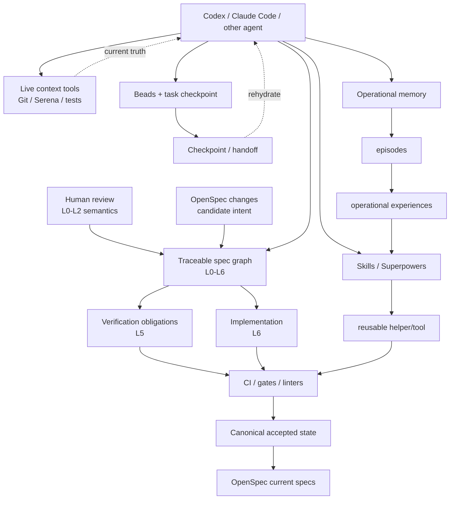
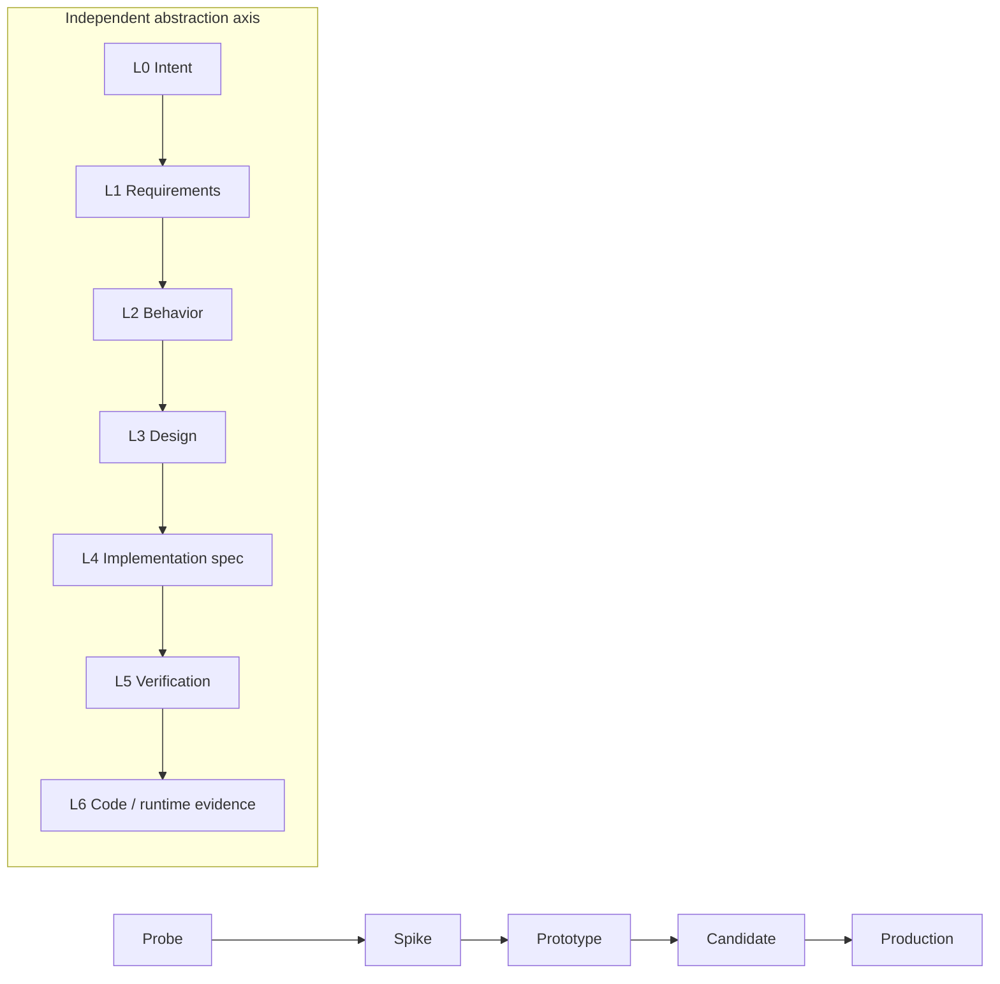
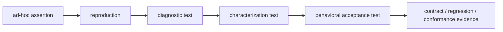
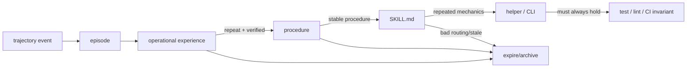
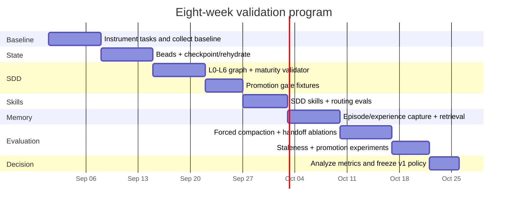
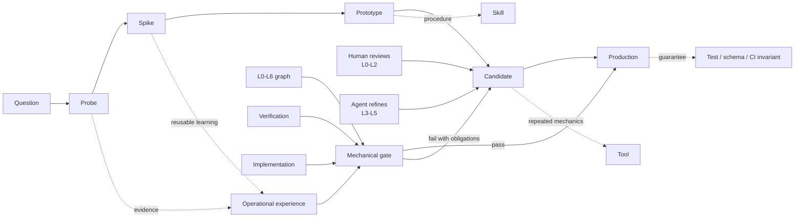

> **Non-normative archival source — 2026-08-28.** The complete report below is preserved verbatim from the owner-supplied task transcript. It records research and proposed framework design; it does not establish repository policy, product commitments, or authorization to install tools, hooks, services, CI, or infrastructure. Conversation-local citations such as `turn21search0` are retained as source text, are not resolvable repository citations, and must not be treated as verification. The companion verified record contains independently checked primary-source references and corrections.

# Designing and Validating a Graduated Agentic SDD and Operational-Memory System

## Executive summary

As of **August 28, 2026**, the strongest architecture for agentic software development is not a single “memory product” or a single SDD framework. The evidence from coding-agent research and current open-source tooling points toward a **layered system in which repository truth, task state, operational experience, procedural skills, executable tools, tests, and CI have different persistence and authority levels**. Research increasingly treats context management as an active agent capability rather than passive transcript summarization: Context-as-a-Tool makes context maintenance callable; SWE-MeM lets an agent decide when and how to compress; CORVUS avoids stale file snapshots by maintaining current file state separately from trajectory history; ACE favors incremental playbook evolution over repeatedly rewriting summaries; and subtask-level memory performs better when retrieval is aligned to the current functional phase rather than an entire superficially similar issue. citeturn21search0turn21search1turn21search2turn22search9turn21search3

The recommended design is therefore:

> **Git repository = canonical truth; spec graph = normative intent; tests/CI = executable guarantees; Beads = work state; operational memory = evidence-backed experience; skills = reusable procedures; live tools = current-world observation.**

For the **graduated SDD lifecycle**, treat `probe → spike → prototype → candidate → production` as an **assurance axis**, separate from the specification abstraction axis `L0 → L6`. A high-level L1 requirement can already be production-stable while an L4 implementation design refining it is still a prototype. Conversely, a temporary spike may have an extremely detailed L4 design without creating a durable L1 product commitment. Keeping these axes independent prevents both premature bureaucracy and accidental contract creation.

The recommended L0–L6 model is:

| Level | Meaning | Primary reviewer |
|---|---|---|
| **L0** | intent, outcomes, goals, non-goals | human |
| **L1** | system/product requirements and guarantees | human |
| **L2** | observable behavior, scenarios, contracts | human for semantic changes |
| **L3** | architecture, components, APIs, data flows | agent + risk-based human review |
| **L4** | detailed implementation specification: types, state transitions, algorithms, failure behavior, migration details | primarily agent |
| **L5** | verification obligations: examples, tests, properties, conformance evidence | machine + agent |
| **L6** | implementation and runtime evidence: code, CI, release, telemetry | machine + agent |

The most promising OSS combination is **OpenSpec + Sphinx-Needs + Beads + Superpowers**, optionally adding **Basic Memory** for durable curated knowledge and **Serena** for live semantic code navigation. OpenSpec supplies the change/canonical-spec distinction; Sphinx-Needs supplies a programmable traceability graph and schema validation; Beads supplies persistent dependency-aware task state; Superpowers supplies reusable development procedures. Basic Memory provides Markdown-backed cross-session knowledge; Serena reduces context waste by giving agents symbol-aware live code access. citeturn18search11turn18search9turn18search33turn19search0turn19search1turn23search2turn16search3

For more requirements-engineering rigor, substitute **StrictDoc** for Sphinx-Needs; it supports extensible requirement grammars and relationships that can encode roles such as `Refines`, `Implements`, and `Verifies`, although its source-code traceability remains documented as experimental. **Doorstop** is the simpler alternative when all that is needed is a Git-native parent/child requirement tree with suspect-link invalidation when parents change. citeturn18search0turn18search20turn18search6

**GitHub Spec Kit and “Spec Kit” are the same project**, so they should not be counted as two tools. Its current workflow is constitution → specify → plan → tasks → implement → converge, with optional clarify/analyze/checklist stages; `converge` now checks current code against the specification artifacts and appends missing work. This makes it a credible **alternative to OpenSpec**, but not something I would normally layer on top of OpenSpec. citeturn20search0turn19search8

The key engineering principle is **promotion rather than accumulation**:

```text
conversation / shell trace
        ↓
episode
        ↓
operational experience
        ↓
procedure
        ↓
SKILL.md
        ↓
script / typed tool
        ↓
test / linter / schema / CI invariant
```

and, independently:

```text
probe → spike → prototype → candidate → production
```

Anything important should move toward a representation with **less dependence on LLM memory**. A recurring fact becomes structured knowledge; a recurring procedure becomes a skill; a recurring shell pipeline becomes a helper; an invariant that must always hold becomes a test, type rule, schema, hook, or CI check. This is closely aligned with OpenAI's current agent-first engineering guidance: a short `AGENTS.md` acts as a map into repository knowledge, while recurring principles are increasingly enforced mechanically rather than left as prose. citeturn22search3turn22search20turn23search7

The proposed acceptance criteria for the system are deliberately measurable: **≥50% reduction in re-derivation tax after forced compaction/handoff; 100% traceability from production normative L0–L2 requirements to L5 verification evidence; <5% false-promotion rate over a defined evaluation window; near-zero unresolved suspect links at production; measurable reduction in stale-memory use; and statistically meaningful improvement over no-memory/whole-episode-memory baselines on repeated task families.** These are proposed engineering thresholds, not values established by the cited literature.

## Evidence base and open-source landscape

The projects in this space solve different problems. Treating them as interchangeable “AI memory tools” obscures their most useful properties. The table below uses **maturity as an engineering assessment as of August 28, 2026**, based on official documentation, release posture, and project scope; it is not a certification.

| Tool | Primary role | License | Maturity assessment | Integration effort | Strongest fit | Principal weakness for this architecture |
|---|---|---:|---|---|---|---|
| **Beads** citeturn19search0turn19search15 | persistent task/work graph and agent work state | MIT | high / active | low–medium | task dependencies, durable work state, handoff; current integrations can inject `bd prime` and support Codex/Claude | not a complete semantic knowledge or spec system; backend/integration surface has evolved rapidly |
| **Superpowers** citeturn19search1turn15search0 | procedural memory / reusable development skills | MIT | high / active | low | TDD, debugging, planning, execution, verification procedures across agents | skills are procedures, not authoritative project memory; correct triggering still needs evaluation |
| **Basic Memory** citeturn16search0turn23search5 | durable human/agent knowledge | AGPL-3.0 | high / active | medium | Markdown source of truth, local knowledge graph, MCP, Claude/Codex memory-bridge hooks | overlaps with custom memory layer; AGPL licensing requires deliberate review for some deployments |
| **Claude-Mem** citeturn16search1turn16search5turn16search7 | passive episodic capture and compressed retrieval | Apache-2.0 | active but fast-moving | medium–high | automatic session/tool observation; progressive `search → timeline → detail` retrieval | additional worker/database/vector infrastructure and model-mediated compression; best treated as telemetry/candidate memory, not canonical truth |
| **Serena** citeturn16search3turn1search6 | live semantic code context and editing | MIT | high / active | medium | symbol-aware navigation, cross-file retrieval/refactoring, large repositories | primarily solves current-code context rather than historical operational memory |
| **Memory Bank** citeturn16search2 | shared cross-agent long-term memory | MIT | emerging / active | medium–high | shared local SQLite memory across Claude Code, Codex and several other agents; hooks + MCP | younger and less battle-tested than the strongest alternatives; introduces background service/model/indexing infrastructure |
| **StrictDoc** citeturn18search8turn18search20 | rigorous requirements/specification graph | Apache-2.0 | established | medium–high | explicit requirements engineering, customizable fields/relations, HTML views, traceability | `.sdoc` model adds ceremony; source-code tracing is still documented as experimental |
| **Doorstop** citeturn17search1turn18search2turn18search6 | lightweight Git-native requirement hierarchy | LGPLv3 | production/stable | low–medium | parent/child requirement trees, fingerprints, suspect-link invalidation | tree-centric model is less expressive than a heterogeneous specification graph |
| **Sphinx-Needs** citeturn18search9turn18search13turn18search33 | programmable traceability graph embedded in documentation | MIT | production-oriented / established | medium | custom object types, arbitrary links, filtering, schema validation, generated docs/JSON | requires Sphinx/documentation configuration and custom policy to express the proposed maturity model |
| **OpenSpec** citeturn19search2turn18search11turn19search14 | change-oriented SDD lifecycle | MIT | high / active | low | proposed changes separate from current canonical specs; proposal/design/tasks/spec deltas; archive/evolution model | not itself a full multilevel requirements graph or operational-memory system |
| **GitHub Spec Kit** (“Spec Kit”) citeturn20search0turn20search6 | end-to-end agentic SDD workflow | MIT | high / active | low–medium | constitution/spec/plan/task/implement/converge workflow and extension system | phase-oriented; less naturally suited than OpenSpec to candidate-vs-canonical spec semantics |
| **BMAD Method** citeturn17search0 | broad adaptive AI-driven development methodology | MIT | high / active | medium–high | right-sized workflow from small changes to deeper product/architecture work; durable context and specialist workflows | much broader and more opinionated than the proposed thin substrate; duplication likely if combined wholesale |
| **BMAD Test Architect** citeturn17search2 | risk-based testing and release gates | MIT | active | medium | requirements→evidence traceability, deterministic criteria registry, CI gate concepts | best used for ideas or as a BMAD module; unnecessary if building a smaller custom gate engine |

### What each project contributes

**Beads** is unusually well matched to the *task-state* portion of operational memory. The current project describes itself as persistent structured memory for coding agents; `bd init` can update `AGENTS.md`, and its integration setup includes both Claude Code and Codex. Its installation documentation recommends the native CLI for shell-capable coding agents, with MCP mainly for environments that cannot directly run the CLI. citeturn19search0turn19search15

**Superpowers** belongs one level lower in the hierarchy: it encodes procedures rather than memories. Its repository explicitly frames the system as an agentic skills framework/software-development methodology, has skill-behavior evaluations, and currently distributes through Claude and Codex plugin mechanisms. That makes it a useful base library for TDD/systematic-debugging/planning behavior while custom project-specific skills handle graduated SDD. citeturn19search1turn15search0turn15search19

This split agrees with the current **Agent Skills** model. Claude Code loads a skill body only when relevant rather than keeping all procedure text permanently in its base instructions; OpenAI likewise defines skills as `SKILL.md`-anchored bundles of instructions, resources, and optional scripts. Both now describe their implementations in terms of the open Agent Skills format. citeturn23search0turn23search1 Skill routing itself must be evaluated: OpenAI's skill-evaluation guidance notes that the `name` and `description` are primary signals controlling whether a skill is selected at all. citeturn23search14

**Basic Memory** is the strongest fit when the team wants an off-the-shelf *curated durable-knowledge layer*. Its local version stores knowledge in ordinary Markdown while maintaining an index/graph and exposes the material to MCP clients; its current release line includes Claude Code and Codex memory-bridge hooks and pre-compaction behavior. citeturn16search0turn23search5 The proposed architecture should still keep requirements, tests and other normative project truth outside that memory store.

**Claude-Mem** and **Memory Bank** solve a different problem: passive or semi-passive capture of interaction histories. Claude-Mem records agent behavior and offers progressive disclosure through compact search results before fetching detailed observations; Memory Bank normalizes hook events, assembles completed turns, processes them with a configured model, stores memory plus embeddings, and exposes retrieval over MCP. citeturn16search4turn16search2 Both are useful experimental sources of **candidate episodes**, but automatic extraction should not be allowed to promote its own summaries into normative repository knowledge without evidence.

**Serena** attacks the context problem upstream by improving live code retrieval. Its MCP tools use symbolic understanding and language-server analysis, so an agent can retrieve definitions/references and perform semantic edits rather than repeatedly reading large files. This fits the CORVUS lesson: where canonical state can be queried cheaply, historical snapshots should not be treated as truth. citeturn16search3turn21search2

For traceability, **Sphinx-Needs** has the best balance of programmability and documentation UX. It provides default “need” types for requirements, specifications, implementations and test cases, but the model is configurable; its schema-validation machinery can enforce relationship constraints, and current examples use stable IDs precisely to prevent title edits from destabilizing references. citeturn18search9turn18search5turn18search33 This is a natural substrate for L0–L6 without requiring all levels to use one prose shape.

**StrictDoc** is stronger where classical requirements engineering or regulatory interoperability matters. Its model supports requirements/specification documents, custom grammars and relations, and traceability views. It is a better choice than Sphinx-Needs when “requirements management” itself is a first-class engineering discipline rather than a documentation graph added to a software repository. citeturn18search0turn18search20

**Doorstop** is the minimalist choice. A parent requirements document and child low-level requirements document are explicit first-class structures; links include a fingerprint, so changing a parent causes its child link to become “suspect” until reviewed. That single feature is particularly valuable for agentic SDD because it gives us a proven mechanism for propagating “semantic freshness” downward. citeturn18search2turn18search6

**OpenSpec** offers the strongest existing candidate/canonical distinction. `specs/` describes current system truth, while `changes/` holds proposed modifications; completed changes merge their spec deltas into the current specs. The project also keeps proposal, design, tasks and spec edits together as the audit history of a change. citeturn18search11turn19search14 For this architecture, that naturally maps to **candidate intent vs accepted contract**.

There is an important consequence: OpenSpec archive operations should be guarded mechanically. A recent project issue points out that archiving an incompletely implemented change can cause the canonical spec to describe intended behavior rather than actual behavior. That is an issue report rather than an authoritative design statement, but it identifies exactly the failure that the proposed `candidate → production` gate should prevent. citeturn19search11

**GitHub Spec Kit** now has a similarly substantive validation loop. Its core workflow is constitution → specify → plan → tasks → implement → converge, with optional clarification, consistency analysis and requirements-quality checklists; `converge` compares the present code to the specification/plan/task artifacts and adds traceable remaining tasks. citeturn20search0turn19search8 Its existing-project guidance explicitly supports reconciling discoveries back into the artifact set rather than assuming specification is permanently one-way. citeturn20search9

**BMAD** is the strongest complete-method alternative rather than a component. Its current positioning emphasizes a right-sized process in which clear small changes can move directly toward implementation while complex work gets more product/architecture depth. Its Test Architect module is particularly relevant because it turns test strategy, requirements-to-evidence traceability, and gate decisions into explicit workflows and a CI-capable CLI. citeturn17search0turn17search2 If adopting BMAD end-to-end, much of the proposed custom orchestration should be adapted to BMAD instead of duplicated.

### What the research says about memory and context

| Evidence | Finding | Architectural consequence |
|---|---|---|
| **Context-as-a-Tool** | Context maintenance becomes an explicit callable operation rather than passive append-only history/compression; the paper targets long-horizon SWE agents. citeturn21search0 | expose `checkpoint`, `compress`, `rehydrate`, `archive-context` as agent operations |
| **SWE-MeM** | agent decides when, what and how to compress from trajectory state, progress and context budget; reports stronger SWE-bench Verified efficiency/performance than its memory baselines. citeturn21search1 | don't trigger memory only at a fixed token threshold; let task phase and state drive it |
| **CORVUS** | immutable historical file snapshots become stale; synchronized current-file state reduced input tokens by 9–50% and reasoning cycles by up to 37% in its evaluations while preserving comparable pass rates. citeturn21search2 | memory stores facts/evidence/pointers, not copies of live source files |
| **ACE** | repeated rewriting can create brevity bias/context collapse; evolving structured playbooks accumulate/refine knowledge incrementally. citeturn22search9turn22search0 | atomic experience records + additive curation beat “summary of summary” as canonical memory |
| **Structurally Aligned Subtask-Level Memory** | coarse whole-issue memories can retrieve the wrong reasoning; subtask-aligned storage/retrieval improved mean Pass@1 by 4.7 percentage points over vanilla agents in reported SWE-bench Verified experiments. citeturn21search3 | every memory has a functional phase such as analyze/debug/design/edit/verify |
| **GitSkills** | 3,797,117 `SKILL.md` files were found across 282,200 public repositories in July 2026; skill selection is probabilistic and there is no compiler/type checker validating that selection. citeturn22search1 | treat skills as software artifacts: version, test, security-review, measure trigger precision/recall |
| **Runme + Codex at OpenAI** | notebooks are used to retain goals, commands, results, interpretations, decisions and dead ends; previous artifacts then become discoverable for later work. citeturn22search2 | preserve evidence-rich task artifacts rather than only conversational summaries |
| **OpenAI harness engineering** | giant instruction files diluted guidance and became stale; a short `AGENTS.md` serves as a map into repository knowledge, with plans, mechanical checks and recurring cleanup. citeturn22search3turn22search20 | keep bootstrap instructions short; push durable knowledge into indexed docs and enforced invariants |

Together these results support a strong design constraint:

> **Memory should preserve what the agent learned; live tools should tell it what is true now.**

A remembered observation such as “integration tests require Redis” should therefore be represented as a provenance-bearing observation that can be revalidated, not as an unconditional eternal instruction.

## Reference architecture for memory, specifications and skills

The architecture should separate **authority**, **persistence**, and **retrieval cost**.



Sphinx-Needs can express heterogeneous requirements/specifications/implementations/tests and validate graph relationships, while OpenSpec can keep proposed changes separate from canonical current behavior. This division avoids forcing one product to be both change-management system and traceability engine. citeturn18search9turn18search33turn18search11

### Memory hierarchy and authority

| Layer | Example | Persist? | Authoritative? | Retrieval |
|---|---|---:|---:|---|
| working context | current hypothesis, last command, temporary file list | no | no | always hot |
| checkpoint | goal, acceptance criteria, branch, next steps | yes | task-state only | automatically on resume |
| episode | raw-ish sequence of meaningful actions/evidence | yes, bounded | no | rarely |
| operational experience | “importing X initializes Y; verified with command Z at commit C” | yes | evidence-backed but revisable | by scope + subtask |
| repository knowledge | architecture, product rules, canonical specs | yes | yes within declared domain | demand-loaded |
| procedural skill | how to debug migrations | yes | process authority only | metadata first, body on trigger |
| executable helper | `tools/agent/inspect-migration` | yes | behavior can be tested | execute |
| invariant | test, schema rule, linter, CI policy | yes | strongest | automatic |

This follows both the current skill-loading model and OpenAI's agent-first repository guidance: skills can progressively disclose detailed procedures, while short initial instructions route agents toward the right repository artifacts. citeturn23search0turn23search1turn22search20

### Orthogonal maturity and abstraction

Do **not** conflate spec level with maturity.



For example:

| Artifact | Possible state |
|---|---|
| `L1: users may cancel pending imports` | production contract |
| `L2: concurrent cancel/complete race semantics` | candidate |
| `L3: cancellation coordinator architecture` | prototype |
| `L4: locking algorithm` | spike |
| diagnostic reproduction test | spike |
| existing database invariant | production |

This prevents the common mistake of making “prototype” a global project label.

### Normativity is another independent state

A useful state progression for specification knowledge is:

```text
observation
   ↓
hypothesis
   ↓
candidate requirement
   ↓
approved behavior
   ↓
supported contract
```

An agent that observes `GET /foo/missing → []` must not silently produce “the API SHALL return `[]` for missing objects.” The first is evidence; the second creates a compatibility obligation.

A `spec-node` should therefore model `level`, `maturity`, and `normativity/status` separately:

```yaml
schema: sdd/spec-node/v1
id: BEH-CANCEL-042
level: L2
kind: behavior
maturity: candidate
normativity: normative
status: approved

title: Cancellation is idempotent
statement: >
  Repeating cancellation of an already-cancelled import returns
  the cancelled state without creating additional side effects.

relations:
  - type: refines
    target: SYS-CANCEL-017
  - type: verified_by
    target: TEST-CANCEL-023
  - type: implemented_by
    target: CODE-CANCEL-008

provenance:
  change: openspec/changes/cancel-import
  authored_by: agent
  approved_by: human
  approved_at: 2026-09-08T14:30:00Z

validity:
  since_commit: 89ab12f
  suspect_if_changed:
    - src/imports/state.py
    - api/imports.openapi.yaml
```

Recommended relations are:

`refines`, `satisfies`, `implements`, `verified_by`, `derived_from`, `observed_in`, `supersedes`, and `contradicts`.

StrictDoc already supports extensible relationship semantics, Doorstop demonstrates parent-link invalidation, and Sphinx-Needs gives enough configurable graph/schema machinery to implement this model directly. citeturn18search20turn18search6turn18search33

### Operational experience and checkpoint schemas

The **episode** is evidence-oriented and relatively raw:

```json
{
  "schema": "agentops/episode/v1",
  "id": "ep_01J...",
  "task_id": "bd-4kq",
  "repo": "example/service",
  "subtask": "diagnose",
  "started_at": "2026-09-08T09:20:00Z",
  "git": {
    "base": "81ae0d1",
    "head": "81ae0d1"
  },
  "goal": "Explain intermittent cancellation test failure",
  "outcome": "success",
  "evidence_refs": [
    ".agent/work/bd-4kq/evidence.jsonl#ev-017"
  ],
  "candidate_experiences": [
    "opx-import-worker-init"
  ],
  "retention": "90d"
}
```

A curated **operational experience** is smaller, subtask-indexed and validity-aware:

```yaml
schema: agentops/operational-experience/v1
id: opx-import-worker-init
scope:
  repo: example/service
  subsystem: tests/integration
subtask: diagnose

kind: observation
claim: >
  Importing package worker.bootstrap starts the scheduler as a module
  side effect in the current test environment.

evidence:
  - id: ev-017
    command: "pytest tests/integration/test_cancel.py -q"
    commit: 81ae0d1
    exit_code: 0
  - id: ev-018
    file: src/worker/bootstrap.py
    commit: 81ae0d1

confidence: verified

validity:
  verified_at: 2026-09-08T10:04:00Z
  expires_after_days: 60
  invalidate_if:
    - src/worker/bootstrap.py
    - tests/conftest.py

promotion:
  reuse_count: 2
  status: candidate
  next: procedure

supersedes: null
```

The **checkpoint** is not a summary of the whole conversation. It is the minimum state necessary to resume correctly:

```yaml
schema: agentops/checkpoint/v1
task_id: bd-4kq
reason: precompact
created_at: 2026-09-08T11:44:00Z

persistent_goal: Fix cancellation race without changing public semantics.

acceptance_criteria:
  - BEH-CANCEL-041
  - BEH-CANCEL-042

target_maturity: candidate

workspace:
  branch: feature/cancel-race
  base: 81ae0d1
  head: a19c221
  dirty: true

approved_specs:
  - SYS-CANCEL-017
  - BEH-CANCEL-041

completed:
  - reproduced race
  - added deterministic fixture

open_hypotheses:
  - id: H3
    statement: scheduler startup is racing transaction teardown
    confidence: medium

failed_approaches:
  - "sleep-based stabilization: rejected because nondeterministic"

next_actions:
  - inspect transaction finalizer
  - write failing race test
  - refine L4 locking design

evidence:
  - .agent/work/bd-4kq/evidence.jsonl#ev-017

memory_refs:
  - opx-import-worker-init
```

This implements the subtask-granularity result from Structurally Aligned Memory and the proactive checkpoint principle suggested by SWE-MeM/CaT without depending on a learned memory policy. citeturn21search3turn21search1turn21search0

### Repository layout

```text
repo/
├── AGENTS.md
├── CLAUDE.md
│
├── docs/
│   ├── architecture/
│   ├── product/
│   └── specs/
│       ├── index.md
│       ├── conf.py
│       ├── l0/
│       ├── l1/
│       ├── l2/
│       ├── l3/
│       ├── l4/
│       └── verification/
│
├── openspec/
│   ├── specs/                  # accepted/current OpenSpec truth
│   └── changes/                # candidate changes
│
├── .agents/
│   └── skills/                 # canonical portable skills
│       ├── context-bootstrap/
│       ├── context-rehydrate/
│       ├── checkpoint/
│       ├── spec-refine/
│       ├── promotion-review/
│       ├── experience-capture/
│       ├── experience-recall/
│       ├── evidence-replay/
│       ├── helper-promoter/
│       ├── skill-gardener/
│       └── spec-gardener/
│
├── .claude/
│   └── skills/                 # Claude adapters if needed
│
├── .agent/
│   ├── work/
│   │   └── <task-id>/
│   │       ├── state.md
│   │       ├── checkpoint.yaml
│   │       ├── evidence.jsonl
│   │       └── decisions.jsonl
│   └── memory/
│       ├── episodes/
│       └── experiences/
│
├── tools/
│   └── agent/
│       ├── sdd
│       ├── checkpoint
│       ├── validate-specgraph
│       ├── evidence-replay
│       └── promote
│
├── tests/
└── .github/
    └── workflows/
        └── agent-sdd.yml
```

A short `AGENTS.md` should route agents to this structure rather than duplicate it. Codex currently reads `AGENTS.md` before work and supports layered repository guidance; OpenAI's own harness-engineering report recommends using the file as a short map rather than an encyclopedia. citeturn23search4turn22search20

### Agent skills and APIs

| Skill | Responsibility | Must not do |
|---|---|---|
| `context-bootstrap` | determine task, maturity target, relevant spec nodes, live repo state | preload the whole repository |
| `context-rehydrate` | reconstruct state from checkpoint + current Git + selected experiences | trust stale source snapshots |
| `checkpoint` | atomically externalize resumable task state | summarize irrelevant transcript history |
| `spec-refine` | generate L(n+1) nodes from approved L(n), preserving explicit relations | invent higher-level requirements |
| `spec-gap-analysis` | find orphan, uncovered, contradictory and ambiguous spec nodes | silently resolve product semantics |
| `promotion-review` | evaluate a maturity transition against mechanical gates | promote on model confidence alone |
| `experience-capture` | convert evidence from completed work into candidate experiences | promote every observation |
| `experience-recall` | retrieve by repo, subsystem, subtask and symptom | return memories contradicted by live state without warning |
| `evidence-replay` | rerun or recheck evidence when cheap | treat old success as fresh proof |
| `helper-promoter` | turn repeated improvised commands into the smallest useful helper | build generic frameworks from one example |
| `skill-promoter` | turn repeated procedures into a skill and add routing evals | import unreviewed external skills blindly |
| `memory/spec-gardener` | detect duplicates, expiry, contradiction, obsolete links and drift | rewrite canonical requirements autonomously |

The skills should expose a thin internal CLI, for example:

```text
sdd bootstrap
sdd checkpoint --reason precompact
sdd rehydrate
sdd evidence add --command "pytest ..."
sdd memory recall --subtask diagnose --scope tests/integration
sdd memory validate opx-import-worker-init
sdd spec lint
sdd spec paths SYS-CANCEL-017
sdd promote path/to/artifact --to candidate
sdd evidence replay ev-017
sdd gc --dry-run
```

Use **hooks for deterministic lifecycle events** and skills for reasoning. Claude Code's skill system is explicitly designed for on-demand procedural context, while Codex's customization guidance recommends pairing reusable skills with mechanical infrastructure such as hooks, linters and type checkers. citeturn23search0turn23search7

The hook lifecycle should be:

```text
SessionStart
  → sdd rehydrate --brief
  → bd prime / task state
  → retrieve only relevant subtask memories

PreCompact
  → checkpoint
  → flush evidence
  → record unresolved hypotheses

AfterCompact / next prompt
  → rehydrate from checkpoint + live repo

PostToolUse
  → append high-value evidence metadata
  → do not copy arbitrary full tool output

Stop / SessionEnd
  → finalize episode
  → propose, but do not auto-approve, promotions

pre-commit
  → fast spec graph validation
  → no malformed evidence IDs

PR CI
  → full maturity gate
  → traceability + tests + drift + freshness
```

Beads' current installation already uses session-start/compaction integrations for Codex and Claude, so a custom hook implementation should coordinate with those hooks rather than blindly adding duplicates. citeturn19search15

## Mechanical promotion gates, tests and CI policy

The central rule is:

> **Do not demand production rigor from a probe, but do not let a candidate become production by merely changing a label.**

Promotion changes the guarantees the organization is claiming. It must therefore be a **validated state transition**.

### Promotion gates

| Transition | Specs | Code | Tests/evidence | Memory/tooling | Required gate |
|---|---|---|---|---|---|
| **probe → spike** | question/hypothesis and success condition recorded; no complete hierarchy required | reproducible command, notebook or scratch artifact | observation or assertion proving what was learned | evidence IDs created | reproduce once from clean-enough state |
| **spike → prototype** | relevant L0/L1 linked if known; candidate L2/L3 explanation of learned behavior | runnable isolated implementation; dependencies captured | smoke/examples; important failures retained as evidence | useful ugly commands may become *promotion candidates* | reproducibility + limitations + provenance |
| **prototype → candidate** | L0/L1 approved; normative L2 complete; affected L3 and detailed L4 generated; every child points upward | moved into normal architecture; typed/linted where applicable; migration/error behavior explicit | test-first obligation for normative new behavior; planned L5 coverage; critical cases implemented | recurring procedure/helper promotion evaluated | no unresolved critical spec gaps or suspect parent links |
| **candidate → production** | canonicalization approved; no unsupported normative leaves; high-level contract deltas explicitly reviewed | supported code path, upgrade/rollback story where relevant, operational ownership | required unit/integration/contract/property/NFR evidence green; observability evidence for relevant systems | stale memories invalidated; permanent lessons promoted or archived | full graph, test, security, migration, runtime and provenance CI |

**Probe** intentionally permits `jq | awk | python`, REPL experiments, temporary tests and `/tmp` files. It asks only that the result be recoverable as evidence.

**Spike** requires reproducibility but explicitly does **not** require the main agent to pause investigation and build polished reusable tooling.

**Prototype** is the first point at which the important behavioral discoveries should be mapped into candidate specification nodes. Prototype tests can still include diagnostics and characterization tests.

**Candidate** is where rigorous SDD/TDD begins. Before candidate implementation work proceeds, the agent must have produced the detailed L3/L4 refinement demanded by the user’s workflow. The human normally approves L0–L2, then the agent generates L3–L5. Implementation may start only after machine checks show that each normative high-level requirement has a well-formed refinement path and explicit verification obligation.

**Production** is not synonymous with “tests pass.” It means the repository is prepared to support the behavior as canonical truth.

### Detailed candidate gate

For each changed normative L0–L2 node:

```text
L0/L1/L2
  │
  ├── at least one valid refinement path to L3/L4
  │
  ├── no contradictory approved child
  │
  ├── at least one L5 verification obligation
  │
  └── declared implementation impact or explicit "no-code"
```

For every changed L4 node:

```text
must specify applicable:
  interfaces/types
  state transitions
  error behavior
  concurrency assumptions
  data persistence
  backwards compatibility
  migration behavior
  security/privacy impact
  verification obligations
```

Not all fields must contain content. They may be explicitly `not-applicable`, which is materially different from being absent.

### Tests should graduate too

Tests have their own lifecycle:



A diagnostic assertion such as:

```python
assert implementation._internal_cache == {"x": 1}
```

can be perfectly good during a spike and inappropriate in production. The promotion review asks:

> What behavior did this diagnostic establish that we intend to preserve?

The production test might instead be:

```python
def test_repeated_lookup_does_not_refetch_resource():
    ...
```

This distinction is important because SDD/TDD should strengthen **intended guarantees**, not fossilize incidental implementation details.

### Traceability checks

The validator should reject or warn on:

| Condition | Candidate | Production |
|---|---:|---:|
| normative L1/L2 without parent/justification | fail | fail |
| normative L1/L2 without L5 verification path | fail | fail |
| approved node with suspect parent | fail | fail |
| candidate L4 without L2/L3 ancestor | warn/fail by policy | fail |
| implementation node without design/spec reference | warn | fail for changed supported code |
| production test with no verification/spec relation | warn | configurable |
| expired operational memory used as gate evidence | fail | fail |
| evidence from a different commit where invalidating files changed | fail/replay | fail/replay |
| unresolved critical contradiction | fail | fail |
| prototype diagnostic test in permanent suite | warn | fail if tagged temporary |
| new contract without human L1/L2 approval | fail | fail |

Doorstop's fingerprint-based suspect-link model provides a concrete precedent for parent-change invalidation; Sphinx-Needs' schema validation provides a configurable way to enforce graph structure. citeturn18search6turn18search33

### Evidence freshness

Every factual memory should have a validity mode:

```yaml
kind: invariant | observation | decision | hypothesis | procedure | environment_fact

freshness:
  policy: immutable | revalidate-on-use | commit-scoped | ttl
  verified_at: ...
  commit: ...
  ttl_days: 30

invalidated_by:
  files: [...]
  dependencies: [...]
  environment: [...]
```

Recommended semantics:

| Kind | Default freshness |
|---|---|
| accepted decision | immutable until superseded |
| product contract | canonical spec version |
| observed code behavior | commit-scoped |
| environment fact | short TTL |
| debugging finding | revalidate when touched files changed |
| reusable procedure | prerequisites/version range |
| hypothesis | never retrieved as fact |

This is the operational application of CORVUS's core observation that file-derived context becomes stale when the underlying repository changes. citeturn21search2

### Promotion of operational knowledge

A promotion should normally require **repeat use plus evidence**, rather than one successful invocation.



Suggested defaults:

```text
episode → experience:
  one significant verified discovery is enough

experience → procedure:
  ≥2 independent uses OR explicit maintainer approval

procedure → skill:
  ≥3 opportunities, stable preconditions, routing examples,
  at least one negative routing example

skill → helper:
  repeated deterministic shell/code mechanics or expensive rediscovery

helper → invariant:
  whenever violation should be impossible rather than merely inconvenient
```

Those numbers are starting policies to evaluate, not research-established constants.

### CI example

```yaml
name: agent-sdd

on:
  pull_request:
  push:
    branches: [main]

jobs:
  spec-and-promotion-gates:
    runs-on: ubuntu-latest

    steps:
      - uses: actions/checkout@v4
        with:
          fetch-depth: 0

      - uses: actions/setup-python@v5
        with:
          python-version: "3.12"

      - name: Install spec tooling
        run: |
          python -m pip install \
            sphinx \
            sphinx-needs \
            myst-parser \
            pytest \
            jsonschema

      - name: Validate structured records
        run: |
          python tools/agent/sdd.py schema-check .agent
          python tools/agent/sdd.py evidence-check

      - name: Validate traceability graph
        run: |
          python tools/agent/sdd.py spec-lint
          python tools/agent/sdd.py spec-coverage \
            --minimum-production 1.0

      - name: Build executable specification
        run: |
          sphinx-build -W -b html docs/specs docs/_build/specs

      - name: Enforce requested maturity transition
        run: |
          python tools/agent/sdd.py gate \
            --base "${{ github.event.pull_request.base.sha || github.event.before }}" \
            --head "${{ github.sha }}"

      - name: Run project verification
        run: |
          pytest -q

      - name: Check no temporary artifacts escaped
        run: |
          python tools/agent/sdd.py hygiene-check
```

Sphinx-Needs is designed to place linked engineering objects such as requirements, specifications, implementations and tests inside the documentation system, making a Sphinx build a sensible place to run traceability/schema validation. citeturn18search9turn18search13

### Core metrics

**Re-derivation tax** measures how much work is repeated after a context boundary.

A useful family of measurements is:

```text
RDT_tool =
  repeated tool actions required after resume
  ------------------------------------------------
  tool actions in the equivalent uninterrupted segment

RDT_tokens =
  excess input tokens until prior competence is restored
  ------------------------------------------------------
  uninterrupted baseline tokens

RDT_time =
  excess wall-clock time until first correct next action
```

Record these separately rather than prematurely collapsing them into one score.

**Repeat-use rate** should measure successful reuse opportunities:

```text
successful uses of promoted artifact
------------------------------------
eligible future opportunities
```

This is better than “number of retrievals,” because a noisy memory system can trivially increase retrieval count.

**False promotion rate**:

```text
promoted artifacts later invalidated as incorrect,
over-specific, harmful, or non-reusable
--------------------------------------------------
all promoted artifacts
```

Track it separately at experience→procedure, procedure→skill and helper→invariant transitions.

**Traceability coverage**:

```text
normative L0-L2 nodes with a valid path to verified L5 evidence
---------------------------------------------------------------
all normative L0-L2 nodes in scope
```

Production target: **100% for in-scope normative nodes**.

Additional metrics should include stale-memory contradiction rate, memory precision@k by subtask, skill-trigger precision/recall, checkpoint recovery latency, number of suspect links, human review time per feature, context tokens per completed issue, promotions surviving 30/90 days, and defects caused by accidental specification promotion.

GitSkills' observation that skill selection is probabilistic and OpenAI's current emphasis on skill-trigger evaluation make trigger precision/recall particularly important. citeturn22search1turn23search14

## Repository bootstrap handout for an implementation agent

The following is designed to be handed directly to Codex, Claude Code, or another shell-capable coding agent. It intentionally selects **OpenSpec + Sphinx-Needs + Beads + Superpowers** as the baseline and makes **Basic Memory** optional. OpenSpec's official model provides candidate changes vs current specs; Beads has direct Claude/Codex setup; Superpowers currently distributes through both agent ecosystems; Sphinx-Needs is installable as a Python package and provides the graph substrate. citeturn18search11turn19search15turn15search0turn18search9

```text
You are bootstrapping a graduated SDD + operational-memory system
into this repository.

GOAL

Create a minimal, inspectable system supporting:

  maturity:
    probe -> spike -> prototype -> candidate -> production

  specification levels:
    L0 intent
    L1 system/product requirement
    L2 observable behavior/contract
    L3 architecture/component design
    L4 detailed implementation specification
    L5 verification obligation/evidence
    L6 implementation/runtime evidence

The two axes are independent.

NON-NEGOTIABLE RULES

1. Do not overwrite existing repository conventions blindly.
   Inspect first; merge with existing AGENTS.md, CLAUDE.md, CI, docs,
   test and packaging structures.

2. Git-tracked repository artifacts are canonical.
   Agent memory is never the sole source of truth for:
   - requirements,
   - APIs,
   - current source contents,
   - tests,
   - security policy,
   - release state.

3. Human review is concentrated on L0-L2.
   Before candidate implementation, generate detailed L3/L4
   refinements and L5 verification obligations.

4. Never convert an observation into a normative requirement
   without an explicit promotion operation.

5. Never promote an artifact only because an LLM says it is ready.
   Promotion is a mechanical gate plus any required human approval.

6. Before compaction/handoff, create a checkpoint.
   After compaction/resume, reconstruct from:
   checkpoint + current Git/filesystem + selected relevant memory.

7. Do not polish experimental code prematurely.
   Probe/spike code may be ugly.
   Promotion extracts the durable behavior and evidence.

8. Keep AGENTS.md short. Put procedures in skills and detailed
   knowledge in repository docs.

DISCOVERY

First inspect:

  pwd
  git status --short
  git rev-parse --show-toplevel
  find . -maxdepth 2 \
    \( -name AGENTS.md -o -name CLAUDE.md -o -name pyproject.toml \
       -o -name package.json -o -name Makefile -o -name justfile \
       -o -name ".github" -o -name "docs" \) -print

Determine the project's language/test/build commands before editing CI.

INSTALLATION

OpenSpec:
  npm install -g @fission-ai/openspec@latest

Then initialize OpenSpec only if it is not already initialized:
  openspec init

Beads:
  macOS/Linux with Homebrew:
    brew install beads

  initialize:
    bd init --quiet

  inspect available integrations:
    bd setup --list

  when running Codex:
    bd setup codex

  when running Claude Code:
    bd setup claude

Sphinx traceability layer:
  python -m pip install sphinx sphinx-needs myst-parser jsonschema

Superpowers:
  Claude Code:
    /plugin install superpowers@claude-plugins-official

  Codex:
    open /plugins, search for "superpowers", install it

Optional durable curated memory:
  uv tool install basic-memory

Do not install optional memory infrastructure until the base
checkpoint/spec/promotion tests pass.

CREATE OR MERGE THIS STRUCTURE

  docs/specs/
  .agents/skills/
  .agent/work/
  .agent/memory/episodes/
  .agent/memory/experiences/
  tools/agent/
  tests/agent_sdd/

Preserve existing directories where equivalent structures exist.

AGENTS.MD TEMPLATE

Merge this with existing instructions; do not duplicate existing rules:

# Agent repository map

## Before work

1. Read the nearest applicable repository instructions.
2. Establish the active task and target maturity.
3. Run `tools/agent/sdd bootstrap`.
4. Read only the relevant canonical specs and architecture docs.
5. Query live repository state before trusting remembered code facts.

## Sources of truth

- `openspec/specs/`: accepted current behavior.
- `openspec/changes/`: proposed changes.
- `docs/specs/`: traceable L0-L6 graph and executable specs.
- tests/CI: executable verification.
- `.agent/work/<task>/`: resumable task state and evidence.
- `.agent/memory/`: operational experience, never canonical product truth.

## Maturity

probe -> spike -> prototype -> candidate -> production.

Never skip a requested promotion gate.

Candidate code requires:
- approved relevant L0/L1,
- complete changed L2 behavior,
- traceable L3/L4 refinement,
- explicit L5 verification obligations.

## Context

Before compaction or handoff:
  tools/agent/sdd checkpoint --reason <reason>

After resume:
  tools/agent/sdd rehydrate

## Promotion

Do not automatically turn:
observation -> requirement,
command -> supported tool,
diagnostic test -> regression contract,
episode -> reusable skill.

Use `tools/agent/sdd promote`.

CLAUDE.MD TEMPLATE

# Claude Code adapter

Read and follow `AGENTS.md` first.

Use project skills for procedures instead of expanding this file.

Before any manual or automatic context-compaction boundary,
checkpoint task state if the available lifecycle hooks have not
already done so.

Treat `.agent/memory/` as historical evidence, not live source truth.
Re-query files, tests and Git whenever the fact may have changed.

SKILLS

Create the following canonical skill directories:

  .agents/skills/context-bootstrap/
  .agents/skills/context-rehydrate/
  .agents/skills/checkpoint/
  .agents/skills/spec-refine/
  .agents/skills/spec-gap-analysis/
  .agents/skills/promotion-review/
  .agents/skills/experience-capture/
  .agents/skills/experience-recall/
  .agents/skills/evidence-replay/
  .agents/skills/helper-promoter/
  .agents/skills/skill-gardener/
  .agents/skills/spec-gardener/

At minimum implement these manifests:

--- .agents/skills/spec-refine/SKILL.md ---

---
name: spec-refine
description: >
  Refine an approved or candidate specification node into the next
  lower specification level while preserving explicit traceability.
  Use when detailed technical specification is required before code.
  Do not use to invent new product goals or silently approve semantics.
---

Inputs:
- source spec-node IDs
- target level
- target maturity
- relevant live repository context

Procedure:
1. Read source nodes and their parent chain.
2. Identify unresolved semantic questions.
3. Stop and surface L0-L2 decisions requiring human judgment.
4. Produce lower-level nodes with `refines` edges.
5. At L4, state applicable interfaces, state, failures, concurrency,
   persistence, migration, security and compatibility behavior.
6. Produce L5 verification obligations for normative behavior.
7. Run the spec graph validator.
8. Never change the parent requirement merely to make refinement easy.

--- .agents/skills/promotion-review/SKILL.md ---

---
name: promotion-review
description: >
  Evaluate whether an artifact or change can advance from probe to
  spike, spike to prototype, prototype to candidate, or candidate
  to production. Use only for explicit maturity transitions.
---

Procedure:
1. Determine current and requested maturity.
2. Load the mechanical gate definition.
3. Check evidence freshness.
4. Validate relevant spec paths.
5. Run required tests/checks.
6. Report pass/fail with exact missing obligations.
7. Do not waive failures.
8. Human-required approvals remain blocked until actually approved.

--- .agents/skills/checkpoint/SKILL.md ---

---
name: checkpoint
description: >
  Persist the minimum state needed for another agent or a post-compaction
  session to continue the current task without rediscovery.
---

Capture:
- persistent goal
- acceptance criteria/spec IDs
- maturity target
- branch/worktree/head
- completed verified work
- unresolved hypotheses
- rejected approaches worth avoiding
- decisions and evidence references
- exact next 1-3 actions

Do not:
- dump the whole transcript
- copy entire source files
- promote hypotheses to facts

STATE FILE

Create `.agent/work/<task-id>/state.md` with this shape:

# Task state

Task: <id>
Target maturity: candidate
Status: active

## Goal

<one durable sentence>

## Acceptance criteria

- <spec IDs / concrete conditions>

## Approved semantics

- <IDs>

## Current findings

- <evidence-backed findings>

## Open hypotheses

- <clearly labelled hypotheses>

## Failed approaches worth retaining

- <attempt + why rejected>

## Next actions

1. ...
2. ...
3. ...

EVIDENCE JSONL

Create append-only `.agent/work/<task-id>/evidence.jsonl`.

Example:

{"id":"ev-001","ts":"2026-09-01T12:00:00Z","kind":"command","command":"pytest tests/foo.py -q","exit_code":1,"git_head":"abc123","purpose":"reproduce failure","artifact":null}
{"id":"ev-002","ts":"2026-09-01T12:04:00Z","kind":"file-observation","path":"src/foo.py","git_head":"abc123","claim":"cleanup occurs after callback","lines":"81-103"}
{"id":"ev-003","ts":"2026-09-01T12:15:00Z","kind":"decision","claim":"do not use sleep-based synchronization","reason":"nondeterministic under load","derived_from":["ev-001"]}

IMPLEMENT THE LOCAL `sdd` TOOL

Prefer the project's normal language.
Do not build a framework.

It must initially support:

  sdd bootstrap
  sdd checkpoint --reason REASON
  sdd rehydrate
  sdd schema-check
  sdd spec-lint
  sdd spec-coverage
  sdd evidence-check
  sdd gate --from MATURITY --to MATURITY
  sdd promote PATH --to MATURITY
  sdd hygiene-check

Use schemas under `tools/agent/schemas/`.

SPEC GRAPH INVARIANTS

Implement tests for:

1. IDs unique.
2. Level in L0..L6.
3. Maturity in probe/spike/prototype/candidate/production.
4. normative candidate/production L1/L2 nodes have valid parents
   unless explicitly declared root.
5. candidate/production normative L1/L2 nodes have a downstream
   verification path.
6. production nodes contain no unresolved `suspect` relation.
7. hypotheses cannot be `normative: true`.
8. expired evidence cannot satisfy production verification.
9. a child whose parent semantic fingerprint changed becomes suspect.
10. production promotion fails without required human approval metadata.

PROMOTION TESTS

Create automated fixture cases proving:

- a probe can exist with no complete L0-L6 chain;
- spike -> prototype fails without reproducibility evidence;
- prototype -> candidate fails with an orphan L4 node;
- prototype -> candidate fails when changed L2 behavior has no L5 plan;
- candidate -> production fails with a suspect parent;
- candidate -> production fails with stale evidence;
- candidate -> production passes with a fully traced approved fixture;
- an `observation` cannot silently become a normative requirement;
- a temporary diagnostic test cannot be marked production evidence
  without an explicit promotion record;
- a pre-compaction checkpoint can reconstruct the exact next action.

DO NOT IMPLEMENT EMBEDDING SEARCH YET.

Use deterministic:
- IDs,
- paths,
- FTS/grep,
- subsystem,
- task phase,
- error strings,
- commands

until evaluation demonstrates a retrieval problem requiring embeddings.

FINAL BOOTSTRAP VALIDATION

Run:
- repository unit tests relevant to changed bootstrap code
- spec graph fixtures
- checkpoint/rehydrate round-trip
- forced stale-parent test
- stale-evidence test
- candidate and production promotion fixtures
- docs/Sphinx build
- existing lint/typecheck where applicable

Then report:
- files created/modified
- tools installed
- exact commands agents should use
- integrations not installed and why
- all gate fixtures and results
- remaining risks
```

The OpenSpec package installation and source-of-truth/change distinction are documented by the project; Beads documents `brew install beads`, `bd init`, and direct Codex/Claude setup; Superpowers documents installation in Claude's and Codex's plugin systems; Basic Memory's local installation is `uv tool install basic-memory`. citeturn18search11turn19search15turn15search0turn23search2

### Executable literate specification example

Classic literate programming tangles narrative into source code. For agentic development, I recommend a different form: **literate executable specification**. Keep ordinary production source files, but combine rationale, formal-ish relationships, examples and executable checks in documentation.

Sphinx-Needs supplies structured linked engineering objects, while MyST-style Markdown provides a convenient document syntax; Sphinx-Needs' configurable types make `behavior`, `design`, `verification` and similar nodes feasible rather than forcing everything into a generic requirement object. citeturn18search9turn18search33

Illustrative MyST/Sphinx source, assuming custom `beh` and `verify` need types and a `refines` relationship have been configured:

````markdown
# Import cancellation

```{beh} Cancellation is idempotent
:id: BEH_CANCEL_042
:status: candidate
:tags: L2,behavior
:refines: SYS_CANCEL_017

For an import already in `Cancelled`, another cancellation request
returns the same externally visible state and creates no additional
side effects.
```

## Detailed refinement

```{spec} Cancellation transaction
:id: IMP_CANCEL_061
:status: candidate
:tags: L4,implementation-spec
:refines: BEH_CANCEL_042

The state transition is performed in one transaction.

Precondition:
`state ∈ {Pending, Cancelling, Cancelled}`.

Postcondition:
a successful request leaves the import in `Cancelled`.

The operation is idempotent for `Cancelled`.
```

## Executable example

```{code-cell} python
from app.imports import cancel, ImportState

job = fixture_import(state=ImportState.CANCELLED)
before = job.side_effect_count

result = cancel(job.id)

assert result.state is ImportState.CANCELLED
assert result.side_effect_count == before
```

```{verify} Idempotence acceptance evidence
:id: TEST_CANCEL_023
:status: candidate
:tags: L5,verification
:refines: BEH_CANCEL_042

The executable example and permanent regression test
`tests/imports/test_cancel.py::test_cancel_is_idempotent`
must both pass.
```
````

The value is not that prose and code share a file. The value is that **normative prose is linked to executable evidence and to the abstraction it refines**.

## Validation strategy, experiments and success criteria

The system should be evaluated as a **software-engineering intervention**, not by asking agents whether they “felt more informed.”

### Experimental design

Use a factorial or staged ablation comparing:

| Condition | Checkpoint | Operational memory | Subtask retrieval | Spec graph/gates | Skills |
|---|---:|---:|---:|---:|---:|
| baseline agent | no | no | no | no | normal agent defaults |
| checkpoint only | yes | no | no | no | defaults |
| coarse memory | yes | whole-task | no | no | defaults |
| subtask memory | yes | yes | yes | no | defaults |
| SDD only | yes | no | no | yes | custom SDD skills |
| full system | yes | yes | yes | yes | full |

The subtask-memory arm is directly motivated by the 2026 finding that phase-aligned memory retrieval can outperform whole-instance memory. citeturn21search3

### Experiment suite

**Forced-compaction experiment.** Choose long tasks and trigger a context boundary after the agent has acquired nontrivial repository knowledge but before completing the fix. Compare repeated reads, repeated tests, tokens and time until the first correct post-resume action.

**Fresh-agent handoff experiment.** Agent A investigates and checkpoints. Agent B starts with no transcript. Compare checkpoint-only, checkpoint+memory and full-system handoff.

**Re-derivation experiment.** Select families of related historical issues where the same subsystem/environment fact recurs. Measure whether future agents rediscover the fact or retrieve/revalidate the existing experience.

**Stale-memory mutation experiment.** Record an operational experience, change the source file listed in `invalidate_if`, then ask an agent to solve a related issue. Passing behavior requires the memory to be flagged stale or replayed rather than trusted.

**Specification-propagation experiment.** Change an approved L1/L2 requirement. The system should mark affected child refinements and verification evidence suspect. Doorstop's fingerprint invalidation is a useful reference behavior. citeturn18search6

**False-contract experiment.** Present agents with incidental current implementation behavior that conflicts with unstated product intent. Measure whether the agent incorrectly promotes observation→normative requirement.

**Promotion-policy experiment.** Compare automatic one-shot promotion against repeat-use/evidence-gated promotion. Measure false-promotion rate and future utility.

**Skill-routing experiment.** Construct positive and negative trigger prompts for every custom skill. Measure trigger precision/recall, including “almost relevant” negative cases. This should be treated as standard testing because skill selection is model-mediated rather than compiled. citeturn22search1turn23search14

**Context-currentness experiment.** Repeatedly edit a file during a task and compare a historical-context baseline with live semantic retrieval. The design mirrors the stale-snapshot problem identified by CORVUS. citeturn21search2

### Datasets

The highest-value dataset is a **repository-native replay corpus**:

```text
30–100 completed issues/PRs
grouped into subsystem/task families
with:
  original issue
  base commit
  gold or accepted patch
  test evidence
  review discussion where available
  recurring lessons / shared infrastructure
```

This corpus uniquely measures operational-memory reuse because public one-shot bug-fixing benchmarks generally lack your organization's repeated local knowledge.

Use **SWE-bench Verified** as an external sanity check because CaT, SWE-MeM and Structurally Aligned Memory all report evaluations in that ecosystem. citeturn21search0turn21search1turn21search3

Use **SWE-POLYBENCH_VERIFIED / SWE-BENCH PRO** specifically for context-efficiency experiments if the required benchmark access and tooling are available; CORVUS used those datasets for stale-file/current-context evaluation. citeturn21search2

Use **GitSkills** as a corpus for analyzing external skill conventions and creating skill-security/routing research, not as a coding-task benchmark. It contains millions of `SKILL.md` occurrences and is particularly useful for studying copied or duplicated skill content. citeturn22search1

### Proposed rollout timeline



### Success criteria

These are recommended initial decision thresholds:

| Metric | Pilot success | Production target |
|---|---:|---:|
| median re-derivation tool-call tax after resume | ↓ ≥30% | ↓ ≥50% |
| median excess tokens after resume | ↓ ≥25% | ↓ ≥40% |
| production normative L0–L2 → verified L5 coverage | ≥95% | **100%** |
| candidate L0–L2 → planned/implemented L5 coverage | ≥95% | ≥98% |
| unresolved suspect relations at production gate | 0 critical | **0** |
| false promotion rate over evaluation window | <10% | <5% |
| stale-memory contradiction reaching implementation | <5% | <2% |
| custom skill positive-trigger recall | ≥90% | ≥95% |
| custom skill negative-trigger precision | ≥90% | ≥95% |
| successful fresh-agent checkpoint recovery | ≥90% | ≥95% |
| median human time reviewing L3–L4 detail | demonstrably below full-manual review | ≥50% lower than reviewing all generated detail |
| escaped semantic defects caused by unreviewed L0–L2 changes | 0 in pilot | **0** |

The first four should be treated as primary metrics. Token savings alone are insufficient: a system that is cheap because it forgets important evidence has failed.

An especially useful composite outcome is:

> **Can a fresh agent, with no transcript, reach the same correct next action after a checkpoint without repeating the expensive investigation?**

That is a direct operational measure of whether the memory system is doing valuable engineering work.

## Stack recommendations, migration path and risk controls

### Recommended minimal stack

```text
OpenSpec
   +
Sphinx-Needs
   +
Beads
   +
Superpowers
   +
small repo-local `sdd` validator
```

Responsibilities:

```text
OpenSpec       candidate change ↔ accepted/current specs
Sphinx-Needs   L0-L6 relationships and schema validation
Beads          task/dependency/resume state
Superpowers    established procedural engineering skills
sdd CLI        maturity gates, evidence freshness, checkpoints
Git/CI/tests   final authority
```

This stack minimizes bespoke infrastructure while covering the core problem. OpenSpec already separates change proposals from current spec truth; Sphinx-Needs already represents linked engineering objects and validates schemas; Beads already provides agent-integrated durable task state; Superpowers provides reusable engineering procedures. citeturn18search11turn18search33turn19search15turn19search1

Do **not** add a vector database initially. Exact identifiers, paths, spec IDs, Git commits, error strings, commands, subsystem labels and functional subtask labels provide strong deterministic retrieval keys. Add semantic retrieval only when eval data demonstrates recall failures.

### Recommended full stack

```text
                       Human review
                         L0-L2
                           │
                    ┌──────▼──────┐
                    │ Sphinx-Needs│
                    │ L0-L6 graph │
                    └──────┬──────┘
                           │
             ┌─────────────┼────────────┐
             │             │            │
       ┌─────▼─────┐ ┌────▼─────┐ ┌────▼─────┐
       │ OpenSpec  │ │  Beads   │ │ MyST /   │
       │ lifecycle │ │ work/task │ │ Sphinx   │
       └─────┬─────┘ └────┬─────┘ └──────────┘
             │             │
       ┌─────▼─────────────▼─────┐
       │      coding agent       │
       │ Codex / Claude / other  │
       └─────┬─────────┬─────────┘
             │         │
       ┌─────▼───┐ ┌───▼──────────┐
       │ Serena  │ │ Basic Memory │
       │ live    │ │ curated ops  │
       │ code    │ │ knowledge    │
       └─────────┘ └──────┬───────┘
                          │
                    optional passive
                    episode telemetry
                    Claude-Mem /
                    Memory Bank

             Superpowers + custom skills
                        │
                        ▼
                 tools → tests → CI
```

Basic Memory's Markdown-backed local architecture makes it the safer default curated-memory addition; Serena complements it by retrieving current code rather than old code snapshots. citeturn23search2turn16search3

Claude-Mem or Memory Bank should be **optional passive telemetry layers** until their value is established experimentally. Their automatic collection can increase recall, but it also increases the privacy, storage, retrieval-noise and model-processing surface. Claude-Mem's architecture includes lifecycle hooks, SQLite and semantic retrieval; Memory Bank similarly captures agent event streams and processes finalized turns before retrieval. citeturn16search5turn16search2

### Requirements-heavy variant

For safety-critical, regulated, ReqIF-oriented or classical systems-engineering environments:

```text
StrictDoc
   +
OpenSpec change layer or custom change-control process
   +
Beads
   +
custom promotion gate
   +
existing test/verification infrastructure
```

StrictDoc's explicit requirements-document model and custom grammars are a better fit where requirements must be managed as engineering records rather than primarily as software documentation. citeturn18search0turn18search20

### Lightweight variant

For a small repository that does not want Sphinx:

```text
OpenSpec
   +
Doorstop
   +
Beads
   +
Superpowers
   +
~500–1500 lines of validation/checkpoint tooling
```

Doorstop gives the most important minimum traceability primitive—hierarchical requirements with validation and suspect-parent detection—without introducing a full documentation stack. citeturn18search2turn18search6

### Spec Kit variant

A team already standardized on GitHub Spec Kit should **keep Spec Kit** and add the L0–L6/maturity graph as an extension rather than migrate to OpenSpec merely for theoretical purity. Its extension/preset system and new `converge` stage provide suitable integration points. citeturn20search0turn20search2

The mapping becomes:

```text
speckit.constitution   → repository-wide invariants
speckit.specify        → L0-L2
speckit.plan           → L3-L4
speckit.tasks          → execution decomposition
custom verification   → L5
speckit.implement      → L6
speckit.converge       → spec/code reconciliation
promotion extension    → maturity gate
```

Spec Kit's current `converge` command intentionally reads spec/plan/tasks as intent and checks present code for missing, partial, contradictory and unrequested work, so it can become one component of the production gate rather than duplicating it. citeturn19search8turn20search5

### BMAD variant

For organizations wanting a complete workflow methodology, BMAD can replace rather than supplement much of OpenSpec/Superpowers. Its current method explicitly scales process depth to the work, and its Test Architect module already embodies risk-scored test planning, traceability and release-gate ideas that overlap heavily with this report. citeturn17search0turn17search2

The missing abstraction remains the explicit **per-artifact probe→production state machine**; add that as metadata and deterministic gates rather than attempting to run both BMAD and a parallel custom methodology.

### Migration sequence

The safest migration is incremental:

**First, instrument without changing process.** Capture task IDs, Git states, tool actions and forced-compaction baseline metrics. Establish re-derivation tax before trying to improve it.

**Next, add checkpoints.** This should deliver value before any long-term memory system exists.

**Then, add L0–L6 identifiers and traceability to one bounded subsystem.** Do not retroactively specify an entire brownfield repository. Spec Kit's own brownfield guidance similarly recommends starting with a bounded change rather than making whole-system documentation the first task. citeturn20search9

**Then, introduce candidate promotion gates.** Start with warnings, collect false positives, then make critical rules blocking.

**Only after this should operational-experience retrieval be introduced.** Otherwise there is no baseline for determining whether memory actually reduces rediscovery.

**Finally, enable automatic episode capture or semantic search only if measured retrieval gaps justify the extra infrastructure.**

### Principal risks and mitigations

| Risk | Failure mode | Mitigation |
|---|---|---|
| **spec bureaucracy** | every tiny experiment gets production-level design ceremony | rigor is maturity-sensitive; probe/spike explicitly bypass lower-level completeness |
| **agent-generated spec spam** | huge L3/L4 documents nobody reviews | structured nodes + schemas; human reviews deltas/questions, not bulk prose |
| **accidental contract promotion** | observed behavior becomes permanent API guarantee | normativity state separate from maturity; human approval required for L0–L2 contracts |
| **stale memory** | agent trusts old repository facts | commit/TTL/invalidation metadata; replay evidence; live source wins |
| **summary collapse** | repeated compression loses detail | immutable evidence + additive experience records, aligned with ACE's evolving-playbook idea citeturn22search9 |
| **wrong memory retrieval** | superficially similar task supplies misleading procedure | index by functional subtask and scope, following subtask-level memory evidence citeturn21search3 |
| **context bloat** | memory system makes agents slower | progressive disclosure; IDs/index before detail; keep live file contents out of historical memory |
| **skill misrouting** | wrong skill triggers or useful skill is missed | positive and negative trigger evals; versioned skill suite; measured precision/recall citeturn22search1turn23search14 |
| **premature helper engineering** | investigation stalls while agent builds infrastructure | separate helper-promotion operation with strict size/time/generalization rules |
| **false promotion** | experimental code/tests become supported prematurely | mechanical state transitions + provenance + human approval for semantic contracts |
| **dual sources of truth** | OpenSpec, Sphinx, memory and prose disagree | declare one normative owner for each artifact; graph indexes references rather than copying content |
| **archive-before-implementation** | proposed behavior becomes canonical despite missing code | block OpenSpec archive behind production/convergence gate; recent project discussion demonstrates this risk citeturn19search11 |
| **memory privacy leakage** | transcripts/tool outputs contain secrets or customer data | allowlists/redaction; never capture secrets by default; retention policies; local-first storage |
| **OSS churn** | hooks/plugins break after agent updates | pin versions in CI, smoke-test integrations, keep canonical data in portable Git files |
| **license mismatch** | embedded memory component conflicts with distribution model | review AGPL implications before incorporating Basic Memory into distributed proprietary infrastructure; its local OSS version is AGPL-3.0 citeturn16search0 |
| **literate-spec drift** | attractive prose becomes stale | normative prose requires IDs/relations/evidence; Sphinx build fails on invalid traceability |
| **automation overreach** | agent silently rewrites approved semantics | skills may propose L0–L2 changes but promotion requires explicit approval metadata |

The overall design principle is deliberately conservative:

> **Let agents generate enormous amounts of low-level reasoning, specifications, tests and evidence; require humans to review the semantic compression at the top; require machines to prove traceability and consistency underneath.**

That changes the human role from reviewing every detailed implementation decision to reviewing **what the system promises**, **which semantic choices remain unresolved**, and **whether evidence justifies promotion**.

The research trend supports this split. Context can be actively maintained rather than passively accumulated; memory can be retrieved at the functional-subtask level; live repository state should remain synchronized rather than frozen into history; structured experience should evolve incrementally; and reusable agent skills themselves need systematic evaluation. citeturn21search0turn21search1turn21search2turn21search3turn22search9turn22search1

The resulting engineering loop is:



The crucial outcome is not “the agent remembers more.” It is that **successful work compounds into progressively stronger, more inspectable and less model-dependent artifacts—while disposable exploration remains cheap enough to encourage learning.**
